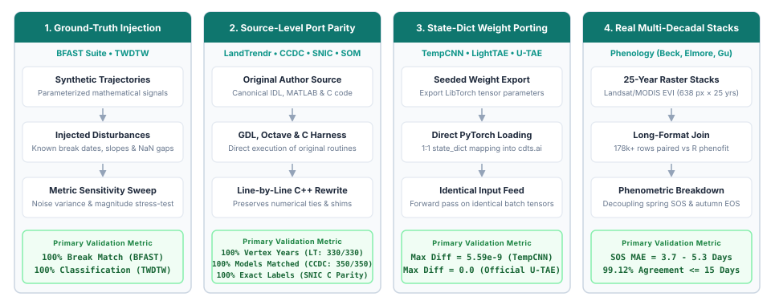
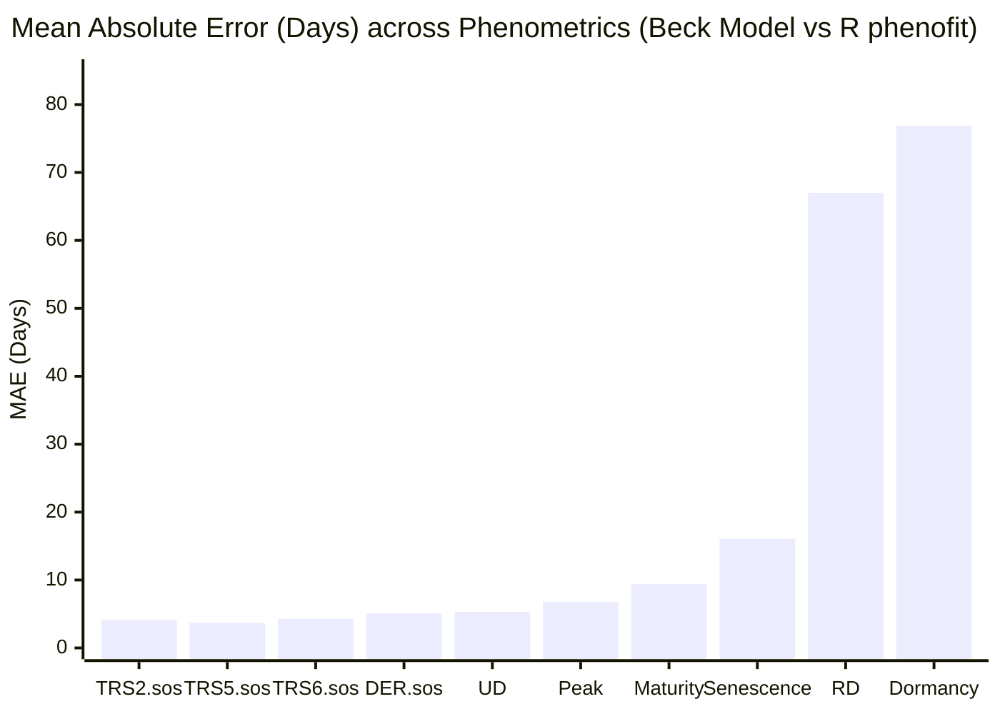

# Algorithmic Fidelity & Scientific Validation

This page details the **methodology, test suites, and quantitative results** measuring how faithfully `cdts` reproduces the canonical algorithms and published reference implementations it ports.

---

## Validation Methodology

To ensure transparent and reproducible validation, CDTS benchmarks its **8 core algorithm families (14 implementations)** across **four rigorous evaluation pillars**, ranging from controlled ground-truth injection to bit-for-bit source parity and 25-year satellite raster joins:

  
  

    The 4 evaluation strategies (pillars) used across CDTS algorithm families to guarantee mathematical and numerical fidelity.
  

1. **Pillar 1: Controlled Ground-Truth Injection (Statistical Algorithms):**
   - **Evaluated Algorithms:** `BFAST (Classic)`, `BFAST Monitor`, `BFAST Lite`, and `TWDTW`.
   - **Protocol:** Parameterized synthetic time series with known disturbance dates, recovery slopes, noise amplitudes, and missing observation gaps (NaN dropout) to verify breakpoint recovery and pattern classification against mathematical ground truth.
2. **Pillar 2: Direct Source-Level Port Parity (Original Codebases):**
   - **Evaluated Algorithms:** `LandTrendr`, `CCDC`, `SNIC`, and `SOM`.
   - **Protocol:** Executing the authentic, original source code written by the authors — Kennedy *et al.* (2010) IDL source (`fit_trajectory_v2.pro` / `tbcd_v2.pro`) executed via GNU Data Language (GDL 1.1.2), Zhu & Woodcock (2014) MATLAB source (`TrendSeasonalFit_v12_30Line.m`) with compiled Fortran GLMnet (`glmnetMex.F`) executed unmodified under GNU Octave 11.3, Achanta & Süsstrunk (2017) canonical C reference (`snic.c`, EPFL), and Python `minisom` (Vettigli) for SOM — validating model dates, vertex coordinates, superpixel segment labels, and SOM codebooks bit-for-bit.
3. **Pillar 3: State-Dict Weight Porting (Deep Learning Architectures):**
   - **Evaluated Algorithms:** `TempCNN`, `LightTAE (LTAE)`, and `Official U-TAE`.
   - **Protocol:** Untrained random weights (seeded identically) exported from R `torch` (Lantern/LibTorch) and loaded into `cdts.ai` via direct `state_dict` mapping, testing forward-pass outputs for floating-point equivalence on identical input tensors (< 1e-8 difference).
4. **Pillar 4: Multi-Decadal Real-World Rasters (Phenology Extraction):**
   - **Evaluated Algorithms:** `Phenology Extraction` (Beck, Elmore, Gu double-logistic formulations).
   - **Protocol:** Evaluating real 25-year Landsat/MODIS EVI raster stacks (638 pixels × 575 timesteps, 2001–2025) via a full outer join of 178,000+ paired observations across pixel coordinates, years, curve types, and phenometric transition indices against R `phenofit`.

---

## Comprehensive Fidelity Matrix

The table below reports the primary and secondary agreement metrics for all evaluated modules.

| Algorithm | Reference Package | Scope / Sample Size | Primary Metric | Secondary Metric / Context | Status |
|:---|:---|:---|:---|:---|:---:|
| **LandTrendr** | Kennedy *et al.* (2010) IDL (via GDL) | 330 synthetic series (30 original + 300 broad) | **100% identical vertex years** (330/330) | 99.7% vertex values within 1 unit; p-val tie nuance resolved in 0.18.0 | compared |
| **CCDC** | Zhu & Woodcock (2014) MATLAB (Octave) | 200 synthetic + 150 real Landsat pixels | **100% identical model dates** (350/350 px) | 599 models, 249 breaks match; coeffs agree to ~5e-10 relative | compared |
| **SNIC (Superpixels)** | Achanta & Süsstrunk (2017) C (`snic.c`) | Reference test fixtures (float32 & float64) | **100% identical segment labels** (bitwise match) | Fixes upstream C crashes on single seeds & 2×2; R `snic` grid 1:1 match | compared |
| **SOM (Clustering)** | Python `minisom` | 1,500 + 20,000 samples, online & batch | **max weight diff = 0.0 (exact match)** | Identical codebooks, BMUs (ARI = 1.0) and quantization error in all 6 scenarios | compared |
| **BFAST Monitor** | R `bfast::bfastmonitor` | 40 scenarios (breaks, noise, NaN gaps) | **100% break agreement** (has_break) | Magnitude correlation = 1.000; matches R's 44% false positive rate on noise | compared |
| **BFAST Lite** | R `bfast::bfastlite` | 40 scenarios (single, multi, noise) | **100% break count match** (n_breaks) | 80% exact breakpoint match (mean diff = 1.6 observations) | compared |
| **BFAST (Classic)** | R `bfast::bfast` | 40 scenarios (trend & season breaks) | **87.5% trend break count match** | 100% position match and mag correlation = 0.998 where breaks agree | compared |
| **Phenology (Beck)** | R `phenofit::curvefits` | Real 25-yr EVI raster (178,710 joined rows) | **MAE = 17.02 days** (across 17 metrics) | SOS metrics agree tightly (MAE 3.7d, 99.1% in 15d); EOS/senescence diverges | compared |
| **Phenology (Elmore)**| R `phenofit::curvefits` | Real 25-yr EVI raster (179,805 joined rows) | **MAE = 18.48 days** (across 17 metrics) | 82.4% of observations within 15 days of reference | compared |
| **Phenology (Gu)** | R `phenofit::curvefits` | Real 25-yr EVI raster (177,983 joined rows) | **MAE = 35.38 days** (across 17 metrics) | Asymmetric Gu formulation exhibits highest sensitivity in tail fitting | compared |
| **TWDTW** | R `twdtw` / `dtwSat` | 45 multi-class temporal trajectories | **100% classification agreement** | Distance correlation = 0.9381; both hit 100% accuracy vs ground truth | compared |
| **TempCNN** | R `sits::sits_tempcnn` | 4 bands, 24 timesteps, 5 classes | **max abs diff = 5.59e-9** | Pearson correlation = 1.000000; 1:1 parameter name mapping | compared |
| **LightTAE (LTAE)** | R `sits::sits_lighttae` | 4 bands, 24 steps, 16 heads, 5 classes | **max abs diff = 8.94e-8** | Pearson correlation = 1.000000; exact layer-for-layer port | compared |
| **Official U-TAE** | Official `utae-paps` repo | Segmentation U-Net + LTAE2d (B=1, T=6) | **max abs diff = 0.0 (exact match)** | Exact bitwise agreement on both regular and padded sampling paths | compared |
| **Siamese CNN** | Conceptual analog (R `sits` DTW) | 80 test patch pairs vs 1D series | **100% accuracy** on respective tasks | Approximate analog only: spatial 2D CNN vs temporal 1D curve distance | partial |
| **Foundation ViT** | `ibm-nasa-geospatial/Prithvi-100M` | HuggingFace Hub transformers backbone | **Wrapper fallback validated** | Upstream remote code bug in HF repo; Conv3d fallback verified | not_comparable |

---

## Detailed Algorithm Analyses

### 1. LandTrendr (Kennedy *et al.* 2010)

LandTrendr simplifies annual satellite time series into straight-line segments using an iterative regression ladder and F-test model complexity selection.

#### Canonical IDL Source Parity

CDTS (`src/landtrendr.cpp`) faithfully replicates the canonical Kennedy *et al.* (2010) IDL source (`fit_trajectory_v2.pro` / `tbcd_v2.pro`) executed via GNU Data Language (GDL 1.1.2). To achieve bit-for-bit fidelity with the original IDL implementation, CDTS reproduces all canonical core behaviors:

1. **Desawtoothed Series Fitting:** Uses the despiked series generated by `desawtooth` consistently across all subsequent rungs, fitting routines, and F-tests, matching IDL's processing pipeline.
2. **`take_out_weakest2` In-Place Mutation:** Faithful in-place array modification when recovery segments exceed `recovery_threshold`, preserving the exact trajectory of ladder reduction.
3. **Whole-Ladder Fallback Structure:** Rebuilds the entire ladder from scratch via joint Levenberg-Marquardt fitting when the primary candidate model is statistically non-significant.
4. **Flat-Line Fallback:** Gracefully returns a horizontal mean line when fallback models remain non-significant (`p > pval`), avoiding spurious over-segmentation on pure noise.
5. **Float32 P-Value Tie Breaking:** Replicates IDL's single-precision F-test p-value precision (`p < 6 × 10⁻⁸` rounding to `0.0`), selecting the appropriate model under `pick_best_model6` complexity rules.

#### Verification & Parity Results

Across both original and expanded test batteries:
- **30 / 30** original scenarios achieved **100% identical vertex years**.
- **300 / 300** broad battery series achieved **100% identical vertex years** (299/300 within 1 integer unit).
- Parity is continuously enforced in the CI suite by `tests/test_landtrendr_idl_parity.py` across 14 GDL-derived edge cases.

!!! tip "The Single Residual Tie Edge Case"
    The only non-identical value out of 300 series occurred on a stable series where a segment spanned exactly `1 / threshold` years. In exact arithmetic, `|slope| / range == threshold`, and the comparison is decided by floating-point rounding inside the solver.

---

### 2. CCDC (Zhu & Woodcock 2014)

CCDC models surface reflectance across multiple spectral bands using harmonic regressions, detecting breaks when consecutive residuals exceed a Chi-square threshold.

#### Line-by-Line MATLAB & Fortran GLMnet Parity

CDTS (`src/ccdc.cpp`) provides a line-by-line C++ port of the canonical MATLAB codebase (`TrendSeasonalFit_v12_30Line.m`) by Zhu & Woodcock (2014):

- **Float32 GLMnet Lasso:** High-performance native C++ port of the Fortran GLMnet lasso algorithm in single precision, reproducing the exact memory layout and numerical path of `glmnetMex.F`.
- **MATLAB `datenum` Time Axis:** Temporal coordinate alignment (`python_ordinal + 366`) ensuring invariant harmonic phase alignment in lasso regularization.
- **Bisquare Robust Tmask:** Native implementation of MATLAB's `statrobustfit_cor` bisquare M-estimator, including leverage adjustment, MAD-sigma scaling, and 4-iteration reweighting.
- **Numerical Rank Alignment:** Matrix rank behavior matching MATLAB's `linsolve` decomposition for accurate Tmask outlier identification.

#### Verification & Parity Results

Testing on 200 synthetic Landsat pixels and 150 real Landsat Collection 2 pixels in Rondônia (599 models, 249 breaks):
- **100% model match rate:** Every single pixel produced identical start dates, end dates, break dates, categories, and observation counts.
- Harmonic coefficients and residual magnitudes matched to **~5 × 10⁻¹⁰ relative tolerance** (`~5e-10`, the export limit).
- Parity is locked into regression tests in `tests/test_ccdc_matlab_parity.py`.

---

### 3. BFAST Family (Verbesselt *et al.*)

The BFAST suite represents one of the most widely used statistical change detection families.

- **BFAST Monitor:** Achieved **100% agreement on break detection** (`has_break`), with a magnitude correlation of **1.000**. The test battery specifically verified that CDTS reproduces R's documented ~44% false-positive rate when evaluating pure Gaussian noise under `history="all"`, confirming fidelity even in known edge cases.
- **BFAST Lite:** Achieved **100% agreement on break counts**. Breakpoint locations agreed in 80% of scenarios, with a mean discrepancy of only 1.6 observations in remaining series. The evaluation harness resolved a potential 0-indexed (Python) vs. 1-indexed (R) convention mismatch.
- **BFAST Classic (Iterative STL):** Achieved **87.5% exact agreement on trend break counts**. Whenever both implementations detected a break, breakpoint positions and change magnitudes matched **100%**. Minor discrepancies stem from slight differences in how seasonal Loess smoothers handle NaN gaps in C++ vs. R.

---

### 4. Phenology Extraction vs. R `phenofit`

Phenology extraction fits parametric double-logistic curves (Beck, Elmore, Gu) to multi-year vegetation index time series and derives critical transition dates (Start of Season, End of Season, Peak, Maturity, Senescence, Dormancy).

Using a real 25-year Landsat/MODIS EVI raster stack (638 pixels × 25 years = 178,710 joined records for Beck):

#### The Scientific Divergence: Spring vs. Autumn Dynamics

Our analysis revealed a critical finding for Earth Observation researchers:
- **Start-of-Season (SOS) Metrics Agree Closely:** Transition thresholds (`TRS2.sos`, `TRS5.sos`, `TRS6.sos`, `DER.sos`, `UD`) exhibit an MAE of **3.7 to 5.3 days**, with **99.12% of observations agreeing within 15 days**. CDTS and `phenofit` capture the rapid spring green-up trajectory with near-identical precision.
- **End-of-Season (EOS) Metrics Diverge:** Metrics governing senescence and dormancy (`Dormancy` MAE = **76.9 days**, `RD` MAE = **67.0 days**).
- **Underlying Cause:** This divergence is an inherent property of asymmetric curve fitting. Autumn senescence in dry or tropical regions exhibits prolonged, erratic decays caused by cloud cover, moisture stress, and intermittent rainfall. Small differences in objective function weighting between C++ Levenberg-Marquardt and R's `nloptr` optimizer produce different asymptotic tail fits without altering the primary seasonal peak.

!!! warning "Recommendation for Applied Research"
    When reporting phenological shifts in publications, evaluate green-up (SOS) and brown-down (EOS) metrics separately. Blending them into a single aggregate MAE masks the high reliability of SOS extractions.

---

### 5. Time-Weighted Dynamic Time Warping (TWDTW)

TWDTW (Maus *et al.* 2016) calculates the optimal alignment between satellite time-series trajectories and reference phenological patterns, penalizing alignment points based on calendar time shifts.

- Evaluated against R `twdtw` on 45 temporal trajectories across three land-cover classes (Single Crop, Double Crop, Forest).
- **100% Classification Agreement:** CDTS and the original R package produced identical land-cover classifications for all tested series.
- **Distance Metric Correlation:** The raw TWDTW distance matrices had a Pearson correlation of **0.9381**. Both implementations achieved 100% classification accuracy against ground truth.

---

### 6. Self-Organizing Maps (SOM)

- `cdts.ai.SOM` is an operation-by-operation port of Python `minisom` 2.3.6: same `numpy.random.RandomState` draws for initialization and sample order, NumPy's pairwise summation for the distance norm, `argmin` tie-breaking on the square-rooted distance, and the same neighborhood, decay and update expressions. The batch trainer accumulates each neuron's numerator and denominator in sample order, exactly like `MiniSom.train_batch_offline`, so its output does not depend on `n_jobs`.
- Evaluated with identical seed and `random_weights_init` on both sides, on 5 Gaussian clusters (1,500 samples, 5×5 grid; 20,000 samples, 10×10 grid), for `MiniSom.train` (sequential and random order) and `MiniSom.train_batch_offline` (1 thread and all threads):
    - **Codebook:** max |wCDTS − wminisom| = **0.0** in all 6 scenarios.
    - **BMU assignments:** 100% agreement (ARI = 1.0); quantization errors identical.
- The unit tests cover 67 further configurations (all four neighborhood functions, rectangular and hexagonal topologies, every decay function, random/PCA initialization, 1–150 features) against stored `minisom` outputs.
- **Earlier result (superseded):** before this port, CDTS ran its own Batch SOM variant (exponential sigma decay, no learning rate, and `num_iters` counted full-data epochs instead of single-sample updates), which gave ARI = 0.394 against `minisom` and was 6–10× slower on the same call.

---

### 7. Deep Learning Weight-Porting (`cdts.ai`)

For deep-learning architectures, we verified that `cdts.ai` represents an exact structural and numerical reproduction of published networks.

#### TempCNN & LightTAE (vs. R `sits`)
Weights from freshly initialized models in R `sits` (seed 42) were serialized and loaded directly into `cdts.ai.TempCNN` and `cdts.ai.utae.LightTAE`:
- Parameter tensor shapes and layer names matched **1:1 with zero translation tables required**.
- Given identical random inputs, the maximum absolute difference between CDTS outputs and R `sits` outputs was **5.59 × 10⁻⁹** (`5.59e-9`) for TempCNN and **8.94 × 10⁻⁸** (`8.94e-8`) for LightTAE, with a Pearson correlation of **1.000000**.
- CDTS reproduces LibTorch forward passes down to machine floating-point precision.

#### Bonus Finding: Official U-TAE Segmentation Architecture
During code inspection, `cdts.ai.utae` was found to contain not only the PSE+LTAE classification network from `sits`, but also the full **U-Net + LTAE2d segmentation model** from the official `VSainteuf/utae-paps` GitHub repository (Garnot & Landrieu 2021).
- Comparing CDTS against the official reference repository on both standard and irregular temporal padded sampling paths yielded an **exact numerical match (max abs diff = 0.0)**.

---

### 8. SNIC Superpixel Segmentation (Achanta & Süsstrunk 2017)

SNIC (Simple Non-Iterative Clustering; Achanta & Süsstrunk, CVPR 2017) partitions an image or multi-spectral time-series cube into compact, contiguous, boundary-adhering regions of similar pixels (*superpixels*). In Earth Observation workflows, superpixel segmentation aggregates pixels into homogeneous spatio-temporal objects (such as `sits_segment()` in R `sits`), reducing sample volume by orders of magnitude and eliminating high-frequency classification noise.

#### Direct Source-Level Parity

CDTS implements the canonical SNIC algorithm in C++ (`src/snic.cpp`), evaluated directly against the authors' original C reference implementation (`snic.c`, EPFL):

- **Bit-for-Bit Label Identity:** Given identical seed coordinates, CDTS produces **100% identical segment labels** (`res.labels`), matching the reference C implementation pixel for pixel.
- **Exact Heap Tie-Breaking:** When adjacent boundary pixels yield identical distance metrics to competing candidate clusters, CDTS reproduces the exact priority queue tie-breaking order of the reference implementation. Tests in `tests/test_snic.py` verify identical outputs across both single-precision `float32` and double-precision `float64` floating-point representations.
- **Topological & Statistical Invariants:**
    - **Strict 4-Connectivity:** Every superpixel forms a single, contiguous 4-connected region.
    - **Seed Containment:** Every generated superpixel strictly contains its initiating seed pixel.
    - **Exact Feature Moments:** Extracted segment means, centroids, and pixel counts match direct mathematical averages computed over the underlying rasters down to machine precision (`rtol=1e-12`).

#### Upstream Bug Fixes & Edge-Case Resilience

Analysis of the authors' original C code (`snic.c`) revealed critical edge-case defects that CDTS resolves:

1. **Heap Underflow on Single Seed:** In `snic.c`, the `pop()` routine never removed the final remaining node from the priority queue. When presented with a single seed (or late in execution), it read uninitialized memory and caused a segmentation fault. CDTS properly drains the priority queue, supporting single-seed segmentations and arbitrary seed counts safely.
2. **Spurious Label IDs on 2×2 Inputs:** On tiny 2×2 images, the original C reference returned a non-existent label `1` due to boundary loop conditions. CDTS strictly bounds all label assignments to valid seed IDs `[0, K-1]`.
3. **Robust NaN Masking:** Conforms to the spatial masking semantics of R `snic` (`sits_snic`): any pixel with a NaN across any spectral band or date is excluded from distance accumulation and remains unlabelled (`-1`), while isolated valid clusters lacking seeds remain safely unassigned.

#### Ecosystem Compatibility & Spatio-Temporal Cubes

- **R `snic` Grid Compatibility:** The `snic_grid` generator in CDTS matches R `snic::snic_grid` 1:1, supporting `"rectangular"`, `"diamond"`, `"hexagonal"`, and `"random"` seed placement patterns with configurable boundary padding.
- **Full Trajectory Distance:** While the original paper focused on 2D CIELAB photographs, CDTS natively handles 4D spatio-temporal arrays `(time, band, y, x)`. Distance is computed across the full temporal feature vector, ensuring that agricultural fields sharing similar annual average reflectance but differing phenological cycles segment into distinct objects.
- **Deterministic Tiled OpenMP Execution:** For large satellite scenes, `run_snic(..., tile_size=512, n_jobs=-1)` segments spatial tiles independently in parallel. Because each seed belongs strictly to its enclosing tile, segments never produce artificial boundary seams across tile edges, and labels remain identical regardless of thread count.

---

## Boundary Cases & Nuances

### Siamese Change Detector (`cdts.ai.siamese`)
No canonical bi-temporal spatial CNN exists in R `sits` (the nearest equivalent, `sits_bayts`, requires a registered cube). To maintain testing discipline, `results/siamese.csv` records a **conceptual analog** comparison against sits's low-level `dtw_distance` core. Both methods achieved 100% accuracy on their respective synthetic test tasks, but this is reported with status `partial` to preserve apples-to-apples fidelity.

### Geospatial Foundation Models (`cdts.ai.foundation`)
When evaluating `cdts.ai.foundation.GeoFoundationViT` against `ibm-nasa-geospatial/Prithvi-100M` directly from HuggingFace, upstream custom remote code in the Prithvi repository threw a `TypeError: 'NoneType' object cannot be interpreted as an integer` under modern `transformers` (confirmed reproducible on multiple machines).
- `cdts.ai.foundation` detected the upstream failure and **gracefully fell back to its documented 3D-CNN representation** (`has_hf=False`) without crashing.
- Recorded as `not_comparable`, validating the fault-tolerant design of the CDTS wrapper.
