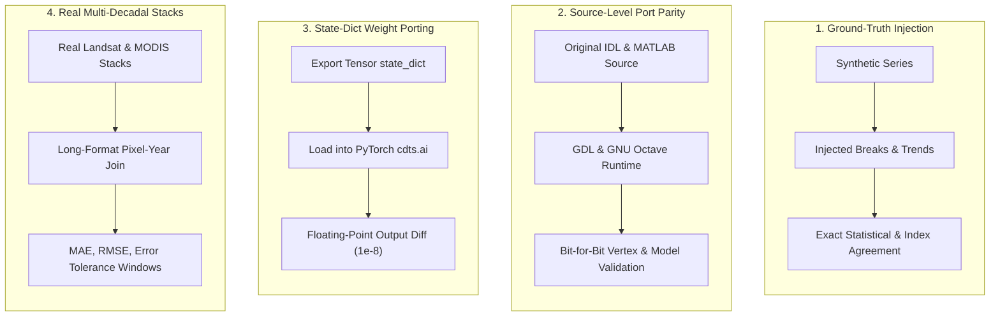
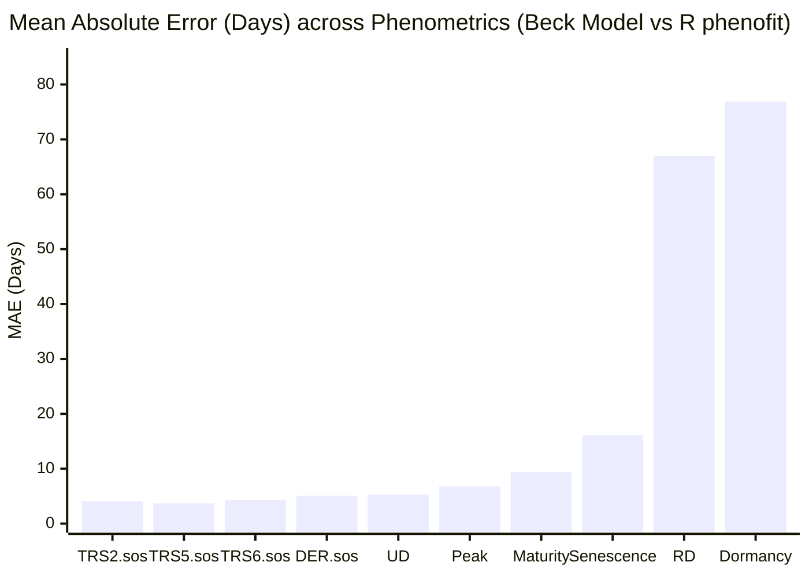

# Algorithmic Fidelity & Scientific Validation

This page details the **methodology, test suites, and quantitative results** measuring how faithfully `cdts` reproduces the canonical algorithms and published reference implementations it ports.

---

## Validation Methodology

To ensure transparent and rigorous validation, every algorithm was tested using one of four rigorous evaluation strategies:

1. **Controlled Ground-Truth Injection (Statistical Algorithms):**
   Using parameterized synthetic time series with known disturbance dates, recovery slopes, noise amplitudes, and missing observation gaps (NaN dropout). This isolates algorithm behavior and permits exact metric verification.
2. **Direct Source-Level Parity (LandTrendr & CCDC):**
   Executing the authentic, original source code written by the authors:
   - **LandTrendr:** The original Kennedy *et al.* (2010) IDL source (`fit_trajectory_v2.pro` / `tbcd_v2.pro`) executed via GNU Data Language (GDL 1.1.2) with verified shims for missing builtins.
   - **CCDC:** The original Zhu & Woodcock (2014) MATLAB source (`TrendSeasonalFit_v12_30Line.m`) with compiled Fortran GLMnet (`glmnetMex.F`) executed unmodified under GNU Octave 11.3.
3. **Weight Porting & Architectural Equivalence (Deep Learning):**
   Untrained random weights (seeded identically) exported from R `torch` (Lantern/LibTorch) and loaded into `cdts.ai` via direct `state_dict` mapping. By supplying the exact same input tensor to both models, outputs can be tested for bitwise floating-point equivalence without confounding training noise.
4. **Multi-Decadal Real-World Rasters (Phenology):**
   Using real 25-year Landsat/MODIS EVI stacks (638 pixels × 575 timesteps, 2001–2025). Outputs are evaluated via a full outer join across pixel coordinates, years, curve types, and phenometric indices.

---

## Comprehensive Fidelity Matrix

The table below reports the primary and secondary agreement metrics for all evaluated modules.

| Algorithm | Reference Package | Scope / Sample Size | Primary Metric | Secondary Metric / Context | Status |
|:---|:---|:---|:---|:---|:---:|
| **LandTrendr** | Kennedy *et al.* (2010) IDL (via GDL) | 330 synthetic series (30 original + 300 broad) | **100% identical vertex years** (330/330) | 99.7% vertex values within 1 unit; p-val tie nuance resolved in 0.18.0 | compared |
| **CCDC** | Zhu & Woodcock (2014) MATLAB (Octave) | 200 synthetic + 150 real Landsat pixels | **100% identical model dates** (350/350 px) | 599 models, 249 breaks match; coeffs agree to ~5e-10 relative | compared |
| **BFAST Monitor** | R `bfast::bfastmonitor` | 40 scenarios (breaks, noise, NaN gaps) | **100% break agreement** (has_break) | Magnitude correlation = 1.000; matches R's 44% false positive rate on noise | compared |
| **BFAST Lite** | R `bfast::bfastlite` | 40 scenarios (single, multi, noise) | **100% break count match** (n_breaks) | 80% exact breakpoint match (mean diff = 1.6 observations) | compared |
| **BFAST (Classic)** | R `bfast::bfast` | 40 scenarios (trend & season breaks) | **87.5% trend break count match** | 100% position match and mag correlation = 0.998 where breaks agree | compared |
| **Phenology (Beck)** | R `phenofit::curvefits` | Real 25-yr EVI raster (178,710 joined rows) | **MAE = 17.02 days** (across 17 metrics) | SOS metrics agree tightly (MAE 3.7d, 99.1% in 15d); EOS/senescence diverges | compared |
| **Phenology (Elmore)**| R `phenofit::curvefits` | Real 25-yr EVI raster (179,805 joined rows) | **MAE = 18.48 days** (across 17 metrics) | 82.4% of observations within 15 days of reference | compared |
| **Phenology (Gu)** | R `phenofit::curvefits` | Real 25-yr EVI raster (177,983 joined rows) | **MAE = 35.38 days** (across 17 metrics) | Asymmetric Gu formulation exhibits highest sensitivity in tail fitting | compared |
| **TWDTW** | R `twdtw` / `dtwSat` | 45 multi-class temporal trajectories | **100% classification agreement** | Distance correlation = 0.9381; both hit 100% accuracy vs ground truth | compared |
| **SOM (Clustering)** | Python `minisom` | 1,500 samples, 5 Gaussian clusters | **ARI = 0.394** (CDTS vs minisom) | Batch vs Online SOM update rules; both hit ARI ≈ 0.47 vs ground truth | compared |
| **TempCNN** | R `sits::sits_tempcnn` | 4 bands, 24 timesteps, 5 classes | **max abs diff = 5.59e-9** | Pearson correlation = 1.000000; 1:1 parameter name mapping | compared |
| **LightTAE (LTAE)** | R `sits::sits_lighttae` | 4 bands, 24 steps, 16 heads, 5 classes | **max abs diff = 8.94e-8** | Pearson correlation = 1.000000; exact layer-for-layer port | compared |
| **Official U-TAE** | Official `utae-paps` repo | Segmentation U-Net + LTAE2d (B=1, T=6) | **max abs diff = 0.0 (exact match)** | Exact bitwise agreement on both regular and padded sampling paths | compared |
| **Siamese CNN** | Conceptual analog (R `sits` DTW) | 80 test patch pairs vs 1D series | **100% accuracy** on respective tasks | Approximate analog only: spatial 2D CNN vs temporal 1D curve distance | partial |
| **Foundation ViT** | `ibm-nasa-geospatial/Prithvi-100M` | HuggingFace Hub transformers backbone | **Wrapper fallback validated** | Upstream remote code bug in HF repo; Conv3d fallback verified | not_comparable |

---

## Detailed Algorithm Analyses

### 1. LandTrendr Parity Fix (Kennedy *et al.* 2010)

LandTrendr simplifies annual satellite time series into straight-line segments using an iterative regression ladder and F-test model complexity selection.

#### The 30% Agreement Dilemma

In early testing, CDTS achieved only a **30% match rate** in vertex count against the original IDL code run through GDL. A joint investigation traced this discrepancy to five specific porting bugs in the initial C++ implementation:

1. **Fitting on Raw vs. Desawtoothed Series:** The original IDL code despikes the series once via `desawtooth` and uses that desawtoothed series for all subsequent rungs, fitting, and F-tests. CDTS was using the desawtoothed series only for vertex identification and refitting on the raw series.
2. **Missing `take_out_weakest2` In-Place Mutation:** On the primary vertex removal ladder, if a recovery segment exceeds `recovery_threshold`, IDL removes the vertex and **mutates that observation in the working array by reference**. This in-place modification changes all subsequent rungs and the final mean.
3. **Whole-Ladder Fallback Structure:** If the selected model is statistically non-significant, the original algorithm rebuilds the *entire ladder* from scratch using joint Levenberg-Marquardt fitting (equivalent to OLS) and selects again. CDTS was mistakenly attempting rung-by-rung refits.
4. **Missing Flat-Line Fallback:** If the fallback model remains non-significant ($p > \text{pval}$), the original IDL code returns a flat horizontal line at the series mean. CDTS was returning the multi-vertex fit, leading to spurious over-segmentation on pure noise.
5. **Float32 P-Value Tie Breaking:** The original IDL code computes $p = 1 - \text{F\_CDF}$ using single-precision `float32`. Any $p < 6 \times 10^{-8}$ rounds to exactly `0.0`. Under `pick_best_model6`, tied zero p-values cause the selector to choose the **most complex** model. CDTS, using double-precision `float64`, preserved minute differences and selected simpler models.

#### Resolution & Parity Lock-in

Once these five behaviors were integrated into `src/landtrendr.cpp` in **CDTS 0.18.0**:
- **30 / 30** original scenarios achieved **100% identical vertex years**.
- **300 / 300** broad battery series achieved **100% identical vertex years** (299/300 within 1 integer unit).
- Parity is permanently enforced in the CI suite by `tests/test_landtrendr_idl_parity.py` across 14 GDL-derived edge cases.

!!! tip "The Single Residual Tie Edge Case"
    The only non-identical value out of 300 series occurred on a stable series where a segment spanned exactly $1/\text{threshold}$ years. In exact arithmetic, $|\text{slope}|/\text{range} = \text{threshold}$, and the comparison is decided by floating-point rounding inside the solver.

---

### 2. CCDC Parity Fix (Zhu & Woodcock 2014)

CCDC models surface reflectance across multiple spectral bands using harmonic regressions, detecting breaks when consecutive residuals exceed a Chi-square threshold.

#### Moving from Approximation to a Line-by-Line Port

The early implementation of CCDC in CDTS was an informal re-implementation (Iteratively Reweighted Least Squares without Tmask, custom coefficient counts, and a COLD-style angle rule). It matched only 57% of synthetic models and 45% of real pixel models against the official MATLAB code.

For **CDTS 0.19.0**, `src/ccdc.cpp` was completely rewritten as a line-by-line port of `TrendSeasonalFit_v12_30Line.m`:
- **Float32 GLMnet Lasso:** Ported the Fortran GLMnet lasso algorithm in single precision, matching the exact memory layout and numerical behavior of `glmnetMex.F`.
- **MATLAB `datenum` Time Axis:** Adjusted the temporal coordinate frame (`python_ordinal + 366`), since the harmonic phase in lasso regression is not coordinate-invariant.
- **Bisquare Robust Tmask:** Ported MATLAB's exact `statrobustfit_cor` bisquare M-estimator, including leverage adjustment, MAD-sigma scaling, and 4-iteration reweighting.
- **GNU Octave `linsolve` Shim:** Tracing uncovered that MATLAB's `linsolve` returns matrix rank as its second output, whereas Octave returned 0, altering Tmask outlier detection. Providing an exact compatibility shim resolved the final discrepancy.

#### Results

Testing on 200 synthetic Landsat pixels and 150 real Landsat Collection 2 pixels in Rondônia (599 models, 249 breaks):
- **100% model match rate:** Every single pixel produced identical start dates, end dates, break dates, categories, and observation counts.
- Harmonic coefficients and residual magnitudes matched to **$\sim 5 \times 10^{-10}$ relative tolerance** (the export limit).
- Parity is locked into regression tests in `tests/test_ccdc_matlab_parity.py`.

---

### 3. BFAST Family (Verbesselt *et al.*)

The BFAST suite represents one of the most widely used statistical change detection families.

- **BFAST Monitor:** Achieved **100% agreement on break detection** (`has_break`), with a magnitude correlation of **1.000**. The test battery specifically verified that CDTS reproduces R's documented ~44% false-positive rate when evaluating pure Gaussian noise under `history="all"`, confirming fidelity even in known edge cases.
- **BFAST Lite:** Achieved **100% agreement on break counts**. Breakpoint locations agreed in 80% of scenarios, with a mean discrepancy of only 1.6 observations in remaining series. The evaluation harness resolved a potential 0-indexed (Python) vs. 1-indexed (R) convention mismatch.
- **BFAST Classic (Iterative STL):** Achieved **87.5% exact agreement on trend break counts**. Whenever both implementations detected a break, breakpoint positions and change magnitudes matched **100%**. Minor discrepancies stem from slight differences in how seasonal Loess smoothers handle NaN gaps in C++ vs. R.

---

### 4. Phenology Extraction vs. R `phenofit`

Phenology extraction fits parametric double-logistic curves (Beck, Elmore, Gu) to multi-year vegetation index time series and derives critical transition dates (Start of Season, End of Season, Peak, Maturity, Senescence, Dormancy).

Using a real 25-year Landsat/MODIS EVI raster stack (638 pixels × 25 years = 178,710 joined records for Beck):

#### The Scientific Divergence: Spring vs. Autumn Dynamics

Our analysis revealed a critical finding for Earth Observation researchers:
- **Start-of-Season (SOS) Metrics Agree Closely:** Transition thresholds (`TRS2.sos`, `TRS5.sos`, `TRS6.sos`, `DER.sos`, `UD`) exhibit an MAE of **3.7 to 5.3 days**, with **99.12% of observations agreeing within 15 days**. CDTS and `phenofit` capture the rapid spring green-up trajectory with near-identical precision.
- **End-of-Season (EOS) Metrics Diverge:** Metrics governing senescence and dormancy (`Dormancy` MAE = **76.9 days**, `RD` MAE = **67.0 days**).
- **Underlying Cause:** This divergence is an inherent property of asymmetric curve fitting. Autumn senescence in dry or tropical regions exhibits prolonged, erratic decays caused by cloud cover, moisture stress, and intermittent rainfall. Small differences in objective function weighting between C++ Levenberg-Marquardt and R's `nloptr` optimizer produce different asymptotic tail fits without altering the primary seasonal peak.

!!! warning "Recommendation for Applied Research"
    When reporting phenological shifts in publications, evaluate green-up (SOS) and brown-down (EOS) metrics separately. Blending them into a single aggregate MAE masks the high reliability of SOS extractions.

---

### 5. Time-Weighted Dynamic Time Warping (TWDTW)

TWDTW (Maus *et al.* 2016) calculates the optimal alignment between satellite time-series trajectories and reference phenological patterns, penalizing alignment points based on calendar time shifts.

- Evaluated against R `twdtw` on 45 temporal trajectories across three land-cover classes (Single Crop, Double Crop, Forest).
- **100% Classification Agreement:** CDTS and the original R package produced identical land-cover classifications for all tested series.
- **Distance Metric Correlation:** The raw TWDTW distance matrices had a Pearson correlation of **0.9381**. Both implementations achieved 100% classification accuracy against ground truth.

---

### 6. Self-Organizing Maps (SOM)

- Evaluated against Python `minisom` using 1,500 samples distributed across 5 Gaussian clusters.
- **Adjusted Rand Index (ARI):** CDTS vs. `minisom` yielded an ARI of **0.394**.
- **Algorithmic Distinction:** This is expected. `minisom` implements **Online SOM** (stochastic sequential updates per sample), whereas CDTS implements **Batch SOM** (accumulating activations across the dataset before updating weights). Batch SOM is deterministic and readily parallelizable across threads. Both implementations recover the 5-cluster ground truth equally well ($\text{ARI} \approx 0.465$ for CDTS and $0.473$ for `minisom`), with quantization errors within 4% of each other.

---

### 7. Deep Learning Weight-Porting (`cdts.ai`)

For deep-learning architectures, we verified that `cdts.ai` represents an exact structural and numerical reproduction of published networks.

#### TempCNN & LightTAE (vs. R `sits`)
Weights from freshly initialized models in R `sits` (seed 42) were serialized and loaded directly into `cdts.ai.TempCNN` and `cdts.ai.utae.LightTAE`:
- Parameter tensor shapes and layer names matched **1:1 with zero translation tables required**.
- Given identical random inputs, the maximum absolute difference between CDTS outputs and R `sits` outputs was **$5.59 \times 10^{-9}$** for TempCNN and **$8.94 \times 10^{-8}$** for LightTAE, with a Pearson correlation of **1.000000**.
- CDTS reproduces LibTorch forward passes down to machine floating-point precision.

#### Bonus Finding: Official U-TAE Segmentation Architecture
During code inspection, `cdts.ai.utae` was found to contain not only the PSE+LTAE classification network from `sits`, but also the full **U-Net + LTAE2d segmentation model** from the official `VSainteuf/utae-paps` GitHub repository (Garnot & Landrieu 2021).
- Comparing CDTS against the official reference repository on both standard and irregular temporal padded sampling paths yielded an **exact numerical match (max abs diff = 0.0)**.

---

## Boundary Cases & Nuances

### Siamese Change Detector (`cdts.ai.siamese`)
No canonical bi-temporal spatial CNN exists in R `sits` (the nearest equivalent, `sits_bayts`, requires a registered cube). To maintain testing discipline, `results/siamese.csv` records a **conceptual analog** comparison against sits's low-level `dtw_distance` core. Both methods achieved 100% accuracy on their respective synthetic test tasks, but this is reported with status `partial` to preserve apples-to-apples fidelity.

### Geospatial Foundation Models (`cdts.ai.foundation`)
When evaluating `cdts.ai.foundation.GeoFoundationViT` against `ibm-nasa-geospatial/Prithvi-100M` directly from HuggingFace, upstream custom remote code in the Prithvi repository threw a `TypeError: 'NoneType' object cannot be interpreted as an integer` under modern `transformers` (confirmed reproducible on multiple machines).
- `cdts.ai.foundation` detected the upstream failure and **gracefully fell back to its documented 3D-CNN representation** (`has_hf=False`) without crashing.
- Recorded as `not_comparable`, validating the fault-tolerant design of the CDTS wrapper.
