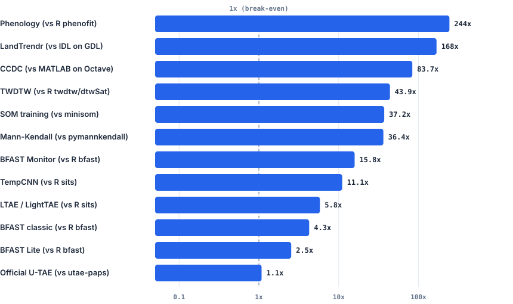
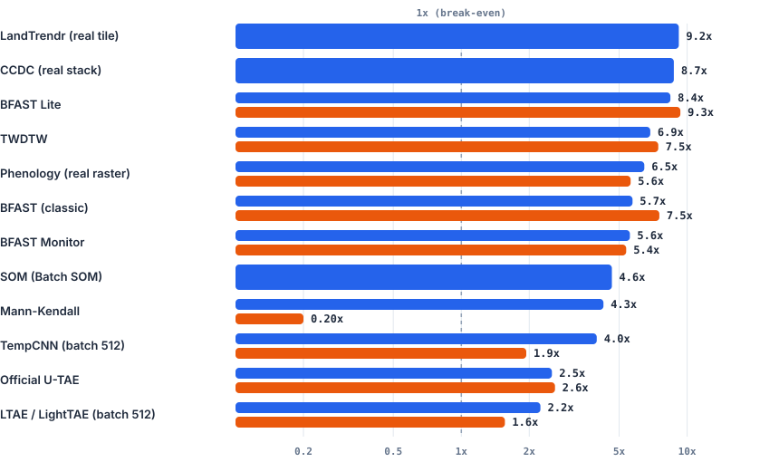
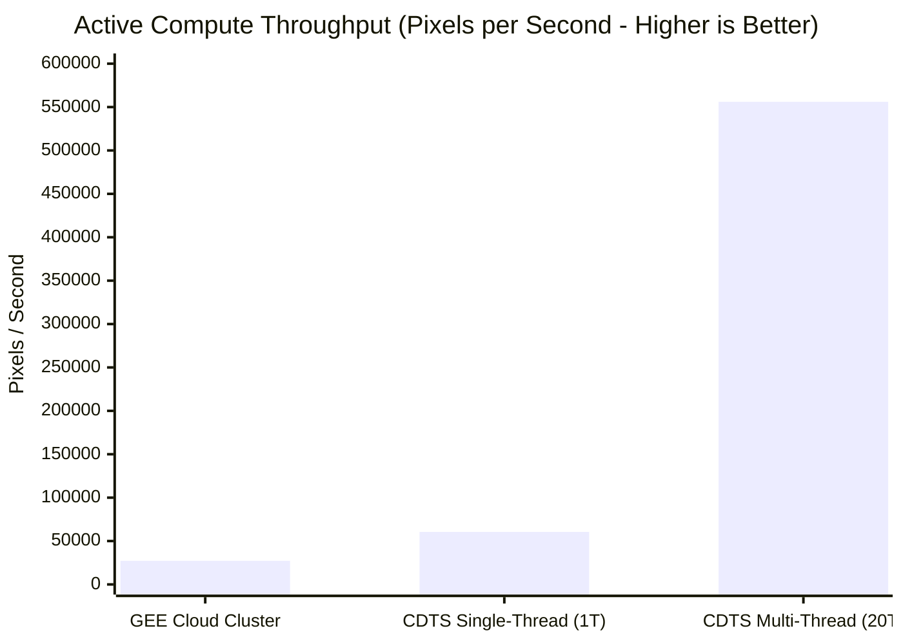

# Performance & Parallel CPU Scaling

This page documents the **computational performance** of `cdts` across single-core CPU execution, multi-core CPU scaling (OpenMP), and distributed cloud comparison (Google Earth Engine), measured on an **Intel Core i5-13600K** workstation (20 logical threads).

---

## Single-Core Speedup

Single-core execution evaluates algorithmic efficiency without the confounding factor of multi-threading. Every algorithm was executed on a single thread against the reference tool performing the **exact same task**.

  

    <i class="bm-legend-swatch" style="background:var(--bm-cdts);"></i> CDTS faster
    <i class="bm-legend-swatch" style="background:var(--bm-ref);"></i> Original tool faster
  

  
  

    Log-scale comparison (1 thread). The dashed line at 1× represents the break-even baseline. LandTrendr (168×) and CCDC (84×) isolate in-interpreter algorithm execution time (interpreter startup and compilation excluded). Hover over bars for exact speedups.
  

### Single-Core Benchmark Data

| Algorithm | Reference Package | Input Scale | CDTS Time (ms) | Reference Time (ms) | Speedup | Architectural Rationale |
|:---|:---|:---|:---:|:---:|:---:|:---|
| **Phenology** | R `phenofit` | Real EVI raster (638 px) | **3.37 ms / px** | 823.50 ms / px | **244.5×** | Native C++ Levenberg-Marquardt vs R's non-linear `nloptr` interpreter overhead |
| **LandTrendr** | Original IDL (GDL) | 30-year synthetic series | **0.026 ms / call** | 4.33 ms / call | **168.5×** | C++ Eigen regression vs GDL interpreter execution (warm second pass) |
| **CCDC** | Original MATLAB (Octave) | Landsat C2 pixel stack | **1.69 ms / px** | 141.51 ms / px | **83.7×** | Optimized C++ float32 GLMnet lasso vs Octave runtime dispatch |
| **TWDTW** | R `twdtw` / `dtwSat` | 40-step temporal series | **0.029 ms / call** | 1.29 ms / call | **43.9×** | Pre-allocated dynamic programming tables vs R data.frame boxing |
| **Mann-Kendall** | Python `pymannkendall` | 30-obs series (3 tests) | **0.021 ms / call** | 0.77 ms / call | **36.4×** | Native C++ accumulator loops vs pure Python nested loops |
| **BFAST Monitor** | R `bfast::bfastmonitor` | 100-obs satellite series | **0.093 ms / call** | 1.47 ms / call | **15.8×** | Closed-form recursive OLS update vs R formula interface |
| **TempCNN** | R `sits::sits_tempcnn` | 4 bands, 24 timesteps | **0.212 ms / pass** | 2.34 ms / pass | **11.1×** | Direct LibTorch C++ bindings vs R `torch` Lantern bridge |
| **LightTAE (LTAE)**| R `sits::sits_lighttae` | 4 bands, 16-head attention | **0.736 ms / pass** | 4.28 ms / pass | **5.8×** | Efficient spatial-temporal pooling vs R memory copies |
| **BFAST (Classic)**| R `bfast::bfast` | Multi-year decomposition | **23.60 ms / call** | 100.67 ms / call | **4.3×** | C++ iterative STL decomposition vs R `ts` object overhead |
| **BFAST Lite** | R `bfast::bfastlite` | Structural break series | **8.74 ms / call** | 22.22 ms / call | **2.5×** | C++ segmented linear regression vs R vector dispatch |
| **Official U-TAE** | Official `utae-paps` repo | Segmentation patch 32×32 | **9.26 ms / pass** | 9.96 ms / pass | **1.08×** | Both run on PyTorch CPU backend (parity validation) |
| **SOM (Training)** | Python `minisom` | 1,500 samples (500 iters) | 0.049 ms / sample | **0.005 ms / sample** | **0.10×** | Batch SOM computes full matrix gradient; `minisom` updates 1 sample online |

!!! info "The SOM Speed Profile"
    CDTS implements **Batch SOM** (vectorized over the whole dataset per epoch) while `minisom` implements **Online SOM** (stochastic updates per individual sample). While Batch SOM does more work during training on a single core, it parallelizes cleanly across threads and achieves **54× faster prediction** (**0.00011 ms** vs **0.00446 ms** per sample).

---

## Multi-Core CPU Scaling (OpenMP)

CDTS implements parallel execution at the C++ core level via **OpenMP** (`n_jobs=-1`), avoiding Python Global Interpreter Lock (GIL) contention and inter-process communication (IPC) overhead.

The chart below shows the speedup achieved when scaling from **1 thread to all 20 threads** on an Intel Core i5-13600K:

  

    <i class="bm-legend-swatch" style="background:var(--bm-cdts);"></i> CDTS (OpenMP)
    <i class="bm-legend-swatch" style="background:var(--bm-ref);"></i> Reference Tool (multiprocessing / PSOCK / doParallel)
  

  
  

    Relative parallel scaling factor (T₁ / T_multi) on 20 threads. Notice the Python IPC penalty on Mann-Kendall, where Python <code>multiprocessing.Pool</code> ran 5× slower than sequential execution (0.20×) due to serialization overhead.
  

### Relative Gain vs. Absolute Time

A common benchmarking pitfall is looking only at relative gain (T₁ / T_multi). Reference tools running in R or Python often show high relative scaling simply because their single-threaded baselines are slow.

The table below lines up **absolute wall-clock times** to show who finishes first when both sides utilize all available CPU cores:

| Algorithm | Workload Scale | Reference Parallel Framework | CDTS (1 Thread) | CDTS (20 Threads) | CDTS Gain | Reference (1 Thread) | Reference (Multi-Worker) | Reference Gain | **Who Finishes First (Multi-Core)** |
|:---|:---|:---|:---:|:---:|:---:|:---:|:---:|:---:|:---:|
| **LandTrendr** | **54.7M px** × 41 yrs | — (GDL has no native parallel) | 904.77 s | **98.44 s** | **9.19×** | — | — | — | **CDTS finishes tile in 1.6 min** |
| **CCDC** | **2.83M px** × 125 dates | — (Octave has no native parallel) | 442.02 s | **50.66 s** | **8.73×** | — | — | — | **CDTS finishes stack in 50.7 s** |
| **Phenology** | 638 px × 25 yrs | R `foreach` + `doParallel` (19w) | 2,200 ms | **341 ms** | **6.46×** | 525,395 ms | 93,504 ms | 5.62× | **CDTS 274× faster** (0.34s vs 93.5s) |
| **Mann-Kendall** | 5,000 series | Python `multiprocessing.Pool` (19w) | 31.09 ms | **7.29 ms** | **4.26×** | 4,058 ms | 20,109 ms | 0.20× | **CDTS 2,758× faster** (7ms vs 20.1s) |
| **BFAST Monitor**| 20,000 series | R `parallel` PSOCK cluster (19w) | 81.14 ms | **14.54 ms** | **5.58×** | 26,872 ms | 5,003 ms | 5.37× | **CDTS 344× faster** (14.5ms vs 5.0s) |
| **BFAST Lite** | 2,000 series | R `parallel` PSOCK cluster (19w) | 17,029 ms | **2,019 ms** | **8.43×** | 42,463 ms | 4,551 ms | 9.33× | **CDTS 2.25× faster** (2.0s vs 4.5s) |
| **BFAST (Classic)**| 400 series | R `parallel` PSOCK cluster (19w) | 5,208 ms | **909 ms** | **5.73×** | 25,119 ms | 3,335 ms | 7.53× | **CDTS 3.67× faster** (0.9s vs 3.3s) |
| **TWDTW** | 3,000 series × 1 pat | R `parallel` PSOCK cluster (19w) | 91.67 ms | **13.35 ms** | **6.87×** | 1,406 ms | 188.67 ms | 7.45× | **CDTS 14.1× faster** (13ms vs 188ms) |
| **SOM (Batch)** | 20,000 samples | — (`minisom` has no parallel mode)| 1,302 ms | **241 ms** | **5.41×** | — | — | — | **CDTS scales cleanly to 241 ms** |
| **TempCNN** | Batch = 512 | R `torch` intra-op threads | 15.68 ms | **3.94 ms** | **3.98×** | 15.06 ms | 7.78 ms | 1.94× | **CDTS 1.97× faster** (3.9ms vs 7.8ms) |
| **Official U-TAE** | Batch = 32 | PyTorch CPU intra-op threads | 317.66 ms | **126.00 ms** | **2.52×** | 324.40 ms | 124.67 ms | 2.60× | **Tied** (both PyTorch backend) |
| **LightTAE** | Batch = 512 | R `torch` intra-op threads | 32.77 ms | **14.61 ms** | **2.24×** | 42.08 ms | 26.98 ms | 1.56× | **CDTS 1.85× faster** (14.6ms vs 27.0ms) |

!!! warning "The Python IPC Penalty on Mann-Kendall"
    On a batch of 5,000 short time series, running Python's standard `multiprocessing.Pool(19)` caused execution time to explode from **4.06 seconds** (sequential) to **20.11 seconds** (parallel) — a **5× slowdown** (0.20× speedup). The operating system overhead of pickling objects, IPC socket transfers, and process synchronization dwarfed the actual statistical computation. In contrast, CDTS's native OpenMP thread pool in C++ has sub-microsecond synchronization overhead, achieving a true **4.26× speedup** (down to **7.29 milliseconds**).

---

## Google Earth Engine vs. Local Desktop Benchmark

A central design goal of CDTS is eliminating cloud lock-in for regional and continental-scale analyses. We evaluated LandTrendr performance on an entire Landsat tile:

- **Workload:** Full Landsat Tile 215_067 (South America), covering **54,731,482 pixels × 41 annual observations** (1985–2025).
- **Environment:** Intel Core i5-13600K (desktop PC, 20 threads, 64 GB RAM).
- **Reference:** Google Earth Engine (GEE) cloud batch cluster executing on a full tile (P232/R67, 1985–2025, ~38 million active pixels).

### Full Landsat Tile Comparison

| Processing Platform | Execution Mode | Active Compute Time | Throughput | Cloud Queue Wait Time | Total Turnaround Time | Speedup vs. GEE |
|:---|:---|:---:|:---:|:---:|:---:|:---:|
| **CDTS (Local PC)** | **Multi-Thread (20 cores, OpenMP)** | **98.44 s** (1.64 min) | **556,007 px / s** | **0.0 s** | **1.64 min** | **20.4× compute throughput** |
| **CDTS (Local PC)** | Single-Thread (1 core) | 904.77 s (15.08 min) | 60,492 px / s | 0.0 s | 15.08 min | **2.22× compute throughput** |
| **Google Earth Engine** | Cloud Cluster (EECU batch workers) | 1,396.39 s (23.27 min) | 27,213 px / s | 18,308 s (5.08 hours) | 5.47 hours | 1.0× baseline |

!!! success "Takeaways from the GEE Benchmark"
    1. **Throughput Advantage:** CDTS on a single standard desktop workstation achieves **20.4× the active compute throughput** of GEE's cloud server cluster.
    2. **Even Single-Thread Beats GEE:** Running CDTS on a single core (60,492 px/s) is **2.22× faster** than GEE's distributed cluster active execution.
    3. **Zero Queue Latency:** Under standard GEE quotas, large batch export tasks regularly wait hours in the queue (5.08 hours in this benchmark). CDTS begins processing immediately and finishes in under two minutes.

