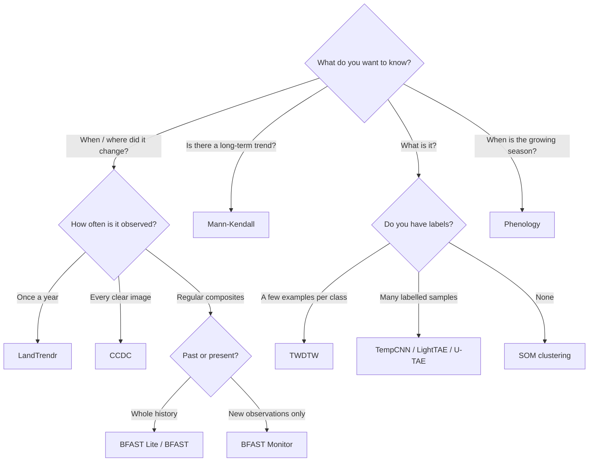
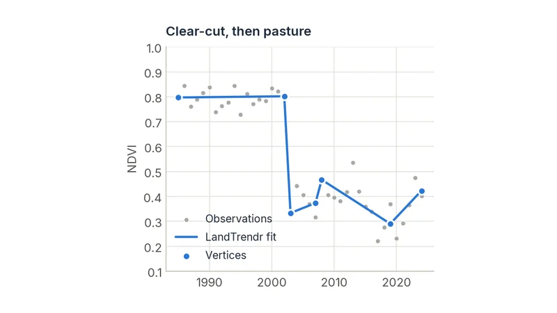
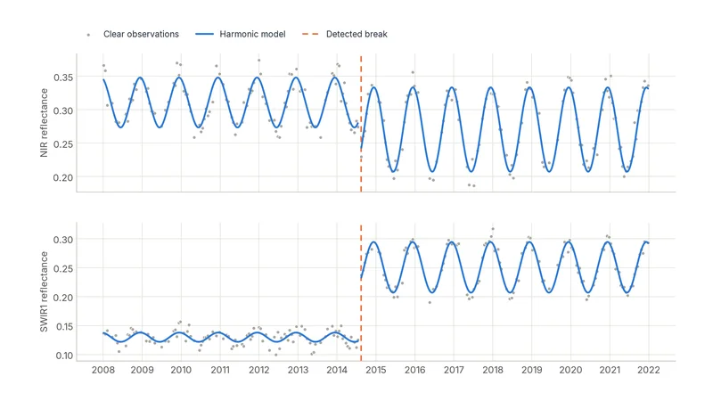
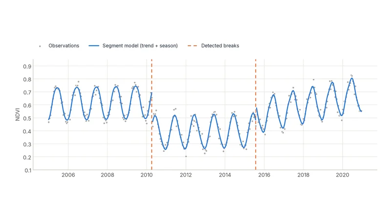
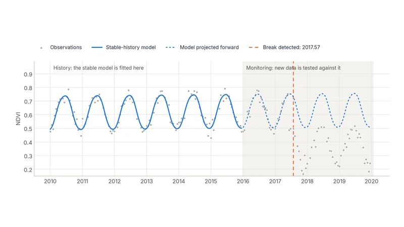

# Choosing an Algorithm

CDTS implements more than a dozen methods. Most projects need one or two. Start from the question you are trying to answer, and let it pick the method.

## Start from your question

| Your question | Use | Needs |
| :--- | :--- | :--- |
| *When* was this area disturbed (cleared, burned) and how badly? | [LandTrendr](../tutorials/landtrendr.md) | One image per year |
| Did anything change, at any time of year? What did it change into? | [CCDC](../tutorials/ccdc.md) | Every clear image (dense, multi-band) |
| Is something changing *right now*, compared with a stable past? | [BFAST Monitor](../tutorials/bfast_monitor.md) | Regular series (e.g. 16-day composites) |
| How many changes happened, and when, in a regular series? | [BFAST Lite](../tutorials/bfast_lite.md) | Regular series |
| Did the trend change, the seasonal cycle, or both? | [BFAST](../tutorials/bfast.md) | Regular series |
| Is this area getting greener or browner over the decades? | [Mann-Kendall](../tutorials/mann_kendall.md) | One value per year (or `method="seasonal"`) |
| When does the growing season start, peak and end? Is this year late? | [Phenology](../tutorials/phenology.md) | Dense series, several per month |
| Which crop or land-cover type is this pixel, given a few examples? | [TWDTW](../tutorials/twdtw.md) | Reference time series per class |
| Which land-cover types exist here, with no labels at all? | [SOM](../tutorials/som.md) | Any cube |
| Can I work with fields and patches instead of pixels? | [SNIC](../tutorials/snic.md) | Any cube |
| I have many labelled samples and want the best classifier. | [TempCNN / LightTAE](../tutorials/ai.md) | Labelled time series |
| I have two dates and labelled change masks. | [Siamese Change Detector](../tutorials/siamese.md) | Image pairs + masks |

## A quick decision guide

## Change detection methods compared

The four change-detection families answer related but different questions. The figures below all come from their tutorials.

<a class="tile" href="../../tutorials/landtrendr/">
  
  Annual · retrospectiveLandTrendrStraight segments through yearly values. Best for forest disturbance and recovery over decades.
</a>

<a class="tile" href="../../tutorials/ccdc/">
  
  Dense · retrospectiveCCDCHarmonic models of the seasonal cycle, multi-band. Dates changes within the year and describes the new state.
</a>

<a class="tile" href="../../tutorials/bfast_lite/">
  
  Regular · retrospectiveBFAST Lite / BFASTStatistically optimal number of breaks in trend and season. Single index.
</a>

<a class="tile" href="../../tutorials/bfast_monitor/">
  
  Regular · near real timeBFAST MonitorIs the newest data consistent with the stable past? The basis of many alert systems.
</a>

| | LandTrendr | CCDC | BFAST Lite / BFAST | BFAST Monitor |
| :--- | :--- | :--- | :--- | :--- |
| Input | 1 index, 1 value per year | Up to 7 bands, every clear observation | 1 index, regular series | 1 index, regular series |
| Models the season? | No (annual values) | Yes (harmonics) | Yes (harmonics) | Yes (harmonics) |
| Detects | Abrupt and gradual change, recovery | Abrupt change, any time of year | Breaks in trend (and season, for BFAST) | The first break after a date |
| Typical use | Forest disturbance history | Land-cover change mapping and classification | Retrospective break analysis | Alerts |
| Speed per pixel | Very fast | Moderate | Moderate | Very fast |

!!! tip "Combine methods"
    The methods complement each other. A common pattern is Mann-Kendall to find *where* a region is trending, then LandTrendr or CCDC to find *when* and *how abruptly* it changed there. Another is Tmask to clean the data before CCDC. See the [User Guide](../tutorials/index.md) for every workflow.
