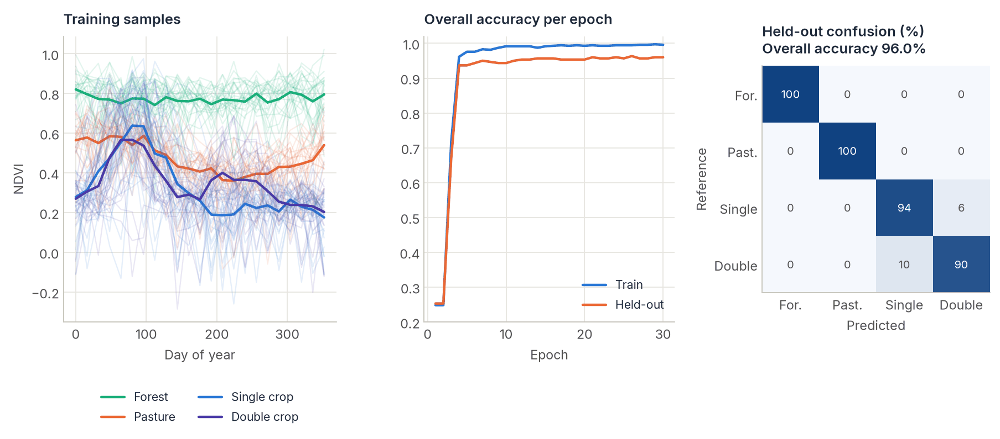

# Deep Learning

<p class="lead">When you have labelled examples, neural networks usually give the most accurate land-cover and change maps. <code>cdts.ai</code> provides PyTorch implementations of the architectures most used for satellite image time series, ported layer for layer from their reference code so that trained weights are interchangeable.</p>

<figure markdown>
  
  <figcaption><strong>A typical result.</strong> A TempCNN trained for 30 epochs on noisy, cloud-contaminated NDVI series of four classes. Forest and pasture are separated perfectly; the remaining errors are between single and double cropping, whose second season is weak in many samples. See the <a href="../tempcnn/">TempCNN tutorial</a>.</figcaption>
</figure>

## Available models

| Model | Task | Input | Dedicated Tutorial | Cross-validated against |
|---|---|---|---|---|
| **LTAE & LightTAE** | Per-pixel time series classification | `(Batch, Time, Bands)` | [LTAE & LightTAE](ltae.md) | `sits_lighttae()` (R) |
| **TempCNN** | Per-pixel time series classification | `(Batch, Bands, Time)` | [TempCNN](tempcnn.md) | `sits_tempcnn()` (R) |
| **UTAE** | Spatio-temporal segmentation (whole-patch class map) | `(Batch, Time, Bands, H, W)` | [UTAE](utae.md) | Official [VSainteuf/utae-paps](https://github.com/VSainteuf/utae-paps) reference (bit-for-bit exact) |
| **Siamese Change Detector** | Bi-temporal change detection (two dates) | Two `(Batch, Bands, H, W)` images | [Siamese Change Detector](siamese.md) | Independent implementation (not a line-for-line port) |
| **GeoFoundationViT** | Transfer learning from pretrained geospatial foundation models | Backbone-dependent | [GeoFoundationViT](geo_foundation_vit.md) | Inherits correctness from the loaded backbone |

**Choosing a model:**

- Have a long, well-sampled per-pixel time series and want the best accuracy? Try [LightTAE](ltae.md) first, and [TempCNN](tempcnn.md) as a faster/simpler baseline.
- Need a class map over a spatial patch, not just individual pixels? Use [UTAE](utae.md).
- Have exactly two dates and want a change map between them? Use the [Siamese Change Detector](siamese.md).
- Have very little labeled data for your task? Consider [GeoFoundationViT](geo_foundation_vit.md) to transfer-learn from a large pretrained backbone.

## Loading patches from a cube

`STACCubeDataset` cuts a lazy xarray cube into spatial patches for PyTorch. Only the patch requested is computed, so you can iterate over cubes far larger than memory:

```python
from torch.utils.data import DataLoader
from cdts.ai import STACCubeDataset

# cube: (time, band, y, x) DataArray, e.g. from cdts.build_time_series
dataset = STACCubeDataset(cube, patch_size=64, stride=64)

patch, dates = dataset[0]
print(patch.shape)   # torch.Size([time, band, 64, 64]); NaN replaced by 0
print(dates.shape)   # torch.Size([time]): day of year of each observation

loader = DataLoader(dataset, batch_size=8, num_workers=2)
```

The dataset yields images only. For supervised training, pair each patch with its label mask (for example by indexing a label raster with the same window), or extract labelled pixel samples into NumPy arrays as the per-model tutorials do.

`STACCubeDataset` also exposes `.dates` — a tensor of day-of-year values derived from the cube's `time` coordinate — which several models (`UTAE` via `batch_positions`, `LightTAE`/`LTAE` via the fixed `day_offsets` passed at construction) need for their positional encodings. See each model's own tutorial for exactly how it expects dates to be shaped and passed in.

## Loss functions for imbalanced classes

Imbalanced classes are very common in change detection and land-cover classification (where the class of interest is often a small minority of pixels). `cdts.ai.losses` provides three specialized loss functions used throughout the per-model tutorials:

```python
from cdts.ai.losses import FocalLoss, TverskyLoss, ContrastiveSiameseLoss

# Down-weights easy examples, focuses training on hard-to-classify pixels
criterion = FocalLoss(alpha=0.25, gamma=2.0)

# Tunable trade-off between False Positives (alpha) and False Negatives (beta);
# setting beta > alpha penalizes missed changes more than false alarms
criterion = TverskyLoss(alpha=0.3, beta=0.7)

# For metric-learning style training of twin encoders (see the Siamese tutorial)
criterion = ContrastiveSiameseLoss(margin=2.0)
```

`FocalLoss` and `TverskyLoss` apply to any model's classifier logits (`(B, C, H, W)` or `(B, C)` vs. integer labels). `ContrastiveSiameseLoss` is specific to twin-encoder architectures — see the [Siamese Change Detector tutorial](siamese.md).

## Next steps

Each architecture has its own complete, standalone tutorial — covering how it works internally, when to use it, how to shape your data for it, model instantiation, a full training loop, inference, and validation methodology:

- [LTAE & LightTAE](ltae.md)
- [UTAE](utae.md)
- [TempCNN](tempcnn.md)
- [Siamese Change Detector](siamese.md)
- [GeoFoundationViT](geo_foundation_vit.md)

!!! tip "Inference over large areas"
    When running inference over massive geographical areas with any of these models, use `xarray` or `rasterio` windows to chunk the data into manageable sizes (e.g., `256x256`), run them through the model, and mosaic the results back together.

---

## References

- Garnot, V. S. F., & Landrieu, L. (2021). Panoptic segmentation of satellite image time series with convolutional temporal attention networks. In **Proceedings of the IEEE/CVF International Conference on Computer Vision (ICCV)** (pp. 4852–4861). [https://doi.org/10.1109/ICCV48922.2021.00483](https://doi.org/10.1109/ICCV48922.2021.00483)
- Garnot, V. S. F., Landrieu, L., Giordano, S., & Chehata, N. (2020). Satellite image time series classification with pixel-set encoders and temporal self-attention. In **Proceedings of the IEEE/CVF Conference on Computer Vision and Pattern Recognition (CVPR)** (pp. 12322–12331). [https://doi.org/10.1109/CVPR42600.2020.01234](https://doi.org/10.1109/CVPR42600.2020.01234)
- Pelletier, C., Webb, G. I., & Petitjean, F. (2019). Temporal convolutional neural network for the classification of satellite image time series. **Remote Sensing**, 11(5), 523. [https://doi.org/10.3390/rs11050523](https://doi.org/10.3390/rs11050523)
- Daudt, R. C., Le Saux, B., & Boulch, A. (2018). Fully convolutional siamese networks for change detection. In **2018 25th IEEE International Conference on Image Processing (ICIP)** (pp. 4063–4067). [https://doi.org/10.1109/ICIP.2018.8451652](https://doi.org/10.1109/ICIP.2018.8451652)
- Jakubik, J., Roy, S., Phillips, C. E., Fraccaro, P., Godwin, D., Zadrozny, B., et al. (2023). *Foundation models for generalist geospatial artificial intelligence*. arXiv:2310.18660. [https://arxiv.org/abs/2310.18660](https://arxiv.org/abs/2310.18660)
- Cong, Y., Khanna, S., Meng, C., Liu, P., Rozi, E., He, Y., Burke, M., Lobell, D., & Ermon, S. (2022). SatMAE: Pre-training transformers for temporal and multi-spectral satellite imagery. In **Advances in Neural Information Processing Systems 35 (NeurIPS 2022)**.
- Lin, T.-Y., Goyal, P., Girshick, R., He, K., & Dollár, P. (2017). Focal loss for dense object detection. In **2017 IEEE International Conference on Computer Vision (ICCV)** (pp. 2999–3007). [https://doi.org/10.1109/ICCV.2017.324](https://doi.org/10.1109/ICCV.2017.324)
- Salehi, S. S. M., Erdogmus, D., & Gholipour, A. (2017). Tversky loss function for image segmentation using 3D fully convolutional deep networks. In **Machine Learning in Medical Imaging (MLMI 2017)** (pp. 379–387). [https://doi.org/10.1007/978-3-319-67389-9_44](https://doi.org/10.1007/978-3-319-67389-9_44)
