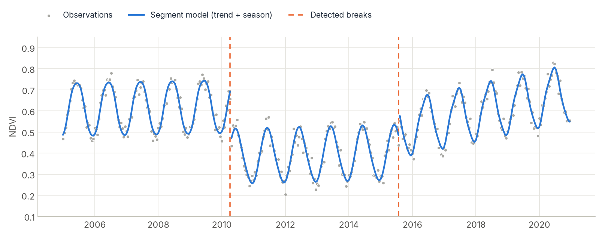

# BFAST Lite

<p class="lead">Find how many structural changes happened in a whole time series, and when. BFAST Lite splits each pixel's history into the statistically optimal number of segments, each with its own trend and seasonal cycle, in a single fast pass.</p>

<div class="glance" markdown>
<div><span class="k">Answers</span><span class="v">How many breaks does this series have, and where are they?</span></div>
<div><span class="k">Input</span><span class="v">A regular series of one index; gaps as <code>NaN</code></span></div>
<div><span class="k">Output</span><span class="v">Number of breaks and the index of each break per pixel</span></div>
<div><span class="k">Reference</span><span class="v">Masiliūnas et al., R package <code>bfast</code> (<code>bfastlite</code>)</span></div>
</div>

<figure markdown>
  
  <figcaption><strong>What BFAST Lite produces.</strong> A synthetic 16-day NDVI series with a drop in 2010 and a partial recovery from 2015. BFAST Lite finds both breaks. The blue lines are a trend-plus-season model refitted within each segment, for display.</figcaption>
</figure>

## How it works

BFAST Lite fits the model `response ~ trend + harmonics` to the series and searches for the set of breakpoints that minimises the total error, using the Bai & Perron dynamic program. Adding breaks always lowers the error, so the number of breaks is chosen with an information criterion (**LWZ** by default) that penalises extra segments. Each segment must hold at least a fraction `h` of the observations.

Unlike the classic [BFAST](bfast.md), it needs no seasonal decomposition and no iteration, and it handles missing values natively. Unlike [BFAST Monitor](bfast_monitor.md), it looks at the whole series retrospectively.

## Step by step

```python
import cdts

# ndvi_16d: (time, y, x) DataArray of 16-day composites starting in January 2010
ndvi_16d = ndvi_16d.chunk({"time": -1, "y": 256, "x": 256})

result = ndvi_16d.cdts.run_bfast_lite(
    start_time=2010.0,
    frequency=23,           # 23 observations per year
    h=0.15,                 # each segment holds >= 15% of the observations
    max_breaks_output=5,    # report at most 5 breaks per pixel
).compute()

n_breaks = result.sel(metric="n_breaks")
first_break = result.sel(metric="breakpoint_idx_1")    # NaN where n_breaks == 0
```

To turn a break index into a date:

```python
first_break_time = 2010.0 + first_break / 23           # fractional year
```

The same function is available for plain Dask arrays as `cdts.bfast.run_bfast_lite_dask`, for large GeoTIFFs as `cdts.run_bfast_lite_image`, and from the shell as [`cdts bfast-lite`](../cli.md#4-bfast-lite-bfast-lite).

## Reading the output

The number of breaks varies by pixel, so the output reserves `max_breaks_output` slots and fills the unused ones with `NaN`. Metric names come from `cdts.bfast.bfl_metric_names(max_breaks_output)`:

| Metric | Meaning |
| :--- | :--- |
| `n_breaks` | Number of breaks chosen by the criterion (`0` if none). |
| `rss` | Residual sum of squares of the selected model. |
| `lwz` | Value of the LWZ criterion that was minimised. |
| `n_valid` | Valid (non-NaN) observations used. |
| `valid` | `1.0` if the series had enough observations to fit. |
| `breakpoint_idx_1 … _k` | 0-based index of each break in chronological order, `NaN` past `n_breaks`. |

!!! note "Indices count valid observations"
    Break indices refer to the series **after `NaN` observations are dropped**. If your series has gaps, map an index back to a date using the dates of the valid observations of that pixel.

## Parameters

| Parameter | Default | Effect |
| :--- | :---: | :--- |
| `start_time` | required | Time of the first observation, as a fractional year. |
| `frequency` | required | Observations per year. |
| `order` | `3` | Number of seasonal harmonics. |
| `h` | `0.15` | Minimum segment size as a fraction of the valid observations. Larger values forbid short segments. |
| `max_breaks_output` | `5` | Number of break slots in the output. |

??? info "Implementation notes, validation and performance"
    **Scope.** The default `breaks="LWZ"` model selection over `response ~ trend + harmon`, with the segment RSS table computed from recursive residuals (O(n²) rather than O(n³)).

    **Validation.** Compared with R's `bfastlite()` on six scenarios (a single break, no break, two candidate breaks, NaN gaps, monthly data, non-default `h`). All six matched `n_breaks` and every break position exactly; `rss` differed by 1e-6 to 1e-7.

    **Performance.** On 300 pixels of 150 observations, R `bfastlite()` took 34.5 ms per pixel and CDTS 11.2 ms single-threaded (about 3×). With `n_jobs=-1` on 15 of 16 cores, 20,000 pixels took 45.5 s instead of 249.3 s single-threaded (a further 5.5×). The gain is smaller than BFAST Monitor's because the dynamic program is real computation on both sides, not interpreter overhead.

## References

- Masiliūnas, D., Tsendbazar, N.-E., Herold, M., & Verbesselt, J. (2021). BFAST Lite: A lightweight break detection method for time series analysis. *Remote Sensing*, 13(16), 3308. [doi:10.3390/rs13163308](https://doi.org/10.3390/rs13163308)
- Bai, J., & Perron, P. (2003). Computation and analysis of multiple structural change models. *Journal of Applied Econometrics*, 18(1), 1–22. [doi:10.1002/jae.659](https://doi.org/10.1002/jae.659)
- Liu, J., Wu, S., & Zidek, J. V. (1997). On segmented multivariate regression. *Statistica Sinica*, 7(2), 497–525.
- Brown, R. L., Durbin, J., & Evans, J. M. (1975). Techniques for testing the constancy of regression relationships over time. *Journal of the Royal Statistical Society, Series B*, 37(2), 149–163.
- R packages [`bfast`](https://github.com/bfast2/bfast) and [`strucchangeRcpp`](https://github.com/bfast2/strucchangeRcpp).
