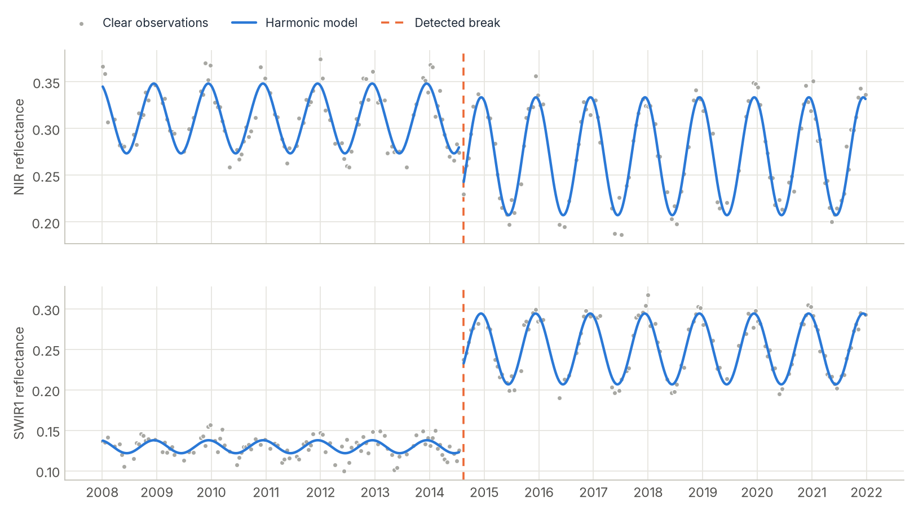

# CCDC

<p class="lead">Continuous Change Detection and Classification models the seasonal rhythm of every pixel from all available clear images, and flags the moment that rhythm breaks. It detects changes at any time of year and describes what the land looks like before and after.</p>

<div class="glance" markdown>
<div><span class="k">Answers</span><span class="v">Did this pixel change, on what date, and into what?</span></div>
<div><span class="k">Input</span><span class="v">Dense multi-band reflectance (× 10,000) plus QA codes</span></div>
<div><span class="k">Output</span><span class="v">Stable segments with start, end and break dates plus harmonic coefficients</span></div>
<div><span class="k">Reference</span><span class="v">Zhu & Woodcock (2014), ported from the original MATLAB</span></div>
</div>

<figure markdown>
  
  <figcaption><strong>What CCDC produces.</strong> A synthetic Landsat pixel observed every 16 days from 2008 to 2021, with about a third of the images lost to clouds. A forest is converted to pasture in mid-2014. CCDC fits one harmonic model per stable period (blue) and detects the break on the first clear observation after the change (orange). Note how the seasonal amplitude also changes after the break.</figcaption>
</figure>

## How CCDC works

Vegetation follows a yearly cycle, so a pixel's reflectance rises and falls with the seasons. CCDC describes that cycle with a small **harmonic model** (a trend line plus sine and cosine waves) fitted to all clear observations:

$$
\hat{\rho}(t) = a_0 + c_1 t + \sum_{k=1}^{3} \left[ a_k \cos\!\left(\tfrac{2\pi k t}{T}\right) + b_k \sin\!\left(\tfrac{2\pi k t}{T}\right) \right], \qquad T = 365.25 \text{ days}
$$

Each new observation is compared with the model's prediction. If **six consecutive observations** (by default) all deviate more than a chi-squared threshold, in several bands at once, CCDC declares a **break**, closes the current model, and starts a new one after it. The model coefficients are also useful by themselves. They describe the "average" appearance of each stable period and make excellent features for land-cover classification.

Compared with [LandTrendr](landtrendr.md), CCDC uses every clear image instead of one per year, works on several bands together, and can date a change to within a few weeks. The price is that it needs dense, well-masked data.

## Step by step

### 1. Load a dense stack and its dates

CCDC works on all clear Landsat-like observations. It expects:

- **Bands** Blue, Green, Red, NIR, SWIR1, SWIR2 (optionally a thermal band), as **surface reflectance × 10,000**. The original's thresholds are defined on that scale, so convert 0–1 reflectance first. For Landsat Collection 2 Level 2 digital numbers, reflectance × 10,000 is `0.275 * DN - 2000`.
- **Dates** as Python **ordinal days** (`date.toordinal()`).

A common layout is a GeoTIFF interleaved by date: for each date, 6 spectral bands followed by the QA band.

```python
import numpy as np
from datetime import date
import zeit

data, profile = zeit.io.load_raster("landsat_dense_stack.tif", raster_check="ccdc")

dates = np.array([date.fromisoformat(d).toordinal()
                  for d in ["2008-01-05", "2008-01-21", "2008-02-06"]])  # one per acquisition

n_dates = len(dates)
per_date = data.reshape(n_dates, 7, *data.shape[1:])      # (date, 6 bands + QA, rows, cols)
reflectance = per_date[:, :6].transpose(1, 0, 2, 3)        # (band, time, rows, cols)
qa_pixel = per_date[:, 6]                                  # (time, rows, cols)
```

### 2. Build the QA codes

CCDC uses the **Fmask codes** of the original implementation:

| Code | Meaning | Used for fitting? |
| :---: | :--- | :---: |
| `0` | clear land | yes |
| `1` | water | yes |
| `2` | cloud shadow | no |
| `3` | snow | handled separately |
| `4` | cloud | no |
| `255` | no observation / fill | no |

For Landsat Collection 2, decode the `QA_PIXEL` bit flags:

```python
qa = np.zeros(qa_pixel.shape, dtype=np.uint8)          # 0 = clear land
qa[(qa_pixel & (1 << 7)) != 0] = 1                     # water
qa[(qa_pixel & (1 << 4)) != 0] = 2                     # cloud shadow
qa[(qa_pixel & (1 << 5)) != 0] = 3                     # snow
qa[(qa_pixel & (1 << 3)) != 0] = 4                     # cloud
qa[(qa_pixel & 1) != 0] = 255                          # fill
```

!!! warning "`1` means water, not cloud"
    A mask with `0 = clear, 1 = cloudy` is **wrong** for CCDC: code `1` is water, which is treated as a *valid* observation. Mark clouds with `4`. If you only have a boolean clear mask (for example from [Tmask](tmask.md)), use `qa = np.where(clear, 0, 4)`.

CCDC already runs its own Tmask screening internally to catch clouds the QA band missed, as the original does.

### 3. Try one pixel

Start with a single pixel to see what CCDC returns:

```python
from zeit.ccdc import run_ccdc

row, col = 200, 310
models = run_ccdc(dates, reflectance[:, :, row, col], qa[:, row, col])

for m in models:
    print(date.fromordinal(m["t_start"]), date.fromordinal(m["t_end"]),
          m["t_break"], m["num_obs"])
```

For the pixel in the figure above this prints two models:

```text
2008-01-05  2014-07-16  735462  82     <- forest; breaks on 735462 = 2014-08-17
2014-08-17  2021-12-26  0       98     <- pasture; no further break (t_break = 0)
```

Each model is a dict with `t_start`, `t_end`, `t_break` (ordinal days, `0` if the model did not end in a break), `coefs` (one row of 8 coefficients per band), `rmse`, `magnitude` (per band), `change_prob`, `category` and `num_obs`, with the same meaning as in the original code.

### 4. Run the whole stack

```python
results = zeit.run_ccdc_array(
    dates,
    reflectance.astype(np.float64),   # (band, time, rows, cols)
    qa,                               # (time, rows, cols)
    max_segments=6,
)
print(results.shape)   # (6, 57, rows, cols) -> (segment, parameter, rows, cols)
```

### 5. Read the output

`results` has one slot per model (up to `max_segments`) and, for each model, `3 + 9 × n_bands` parameters:

| Index | Content |
| :--- | :--- |
| `0` | `t_start`: first date of the model (ordinal) |
| `1` | `t_end`: last date of the model |
| `2` | `t_break`: date of the break that ended it, `0` if none |
| `3 + 9b` | RMSE of band `b` |
| `4 + 9b … 11 + 9b` | the 8 coefficients of band `b`: intercept, slope, cos/sin for 1, 2 and 3 cycles per year |

Unused model slots are all zeros. To map the date of the first change:

```python
first_break = results[0, 2]                      # (rows, cols), ordinal days, 0 = no change
changed = first_break > 0
print(f"{changed.mean():.1%} of pixels changed")

# Convert ordinal days to fractional years for mapping
def to_frac_year(ordinal):
    d = date.fromordinal(int(ordinal))
    return d.year + (d.timetuple().tm_yday - 1) / 365.25

break_year = np.zeros(first_break.shape, dtype="float32")
break_year[changed] = [to_frac_year(d) for d in first_break[changed]]

zeit.save_raster(break_year, "results/ccdc_first_break.tif",
                 crs=profile["crs"], transform=profile["transform"], nodata=0)
```

### 6. Predict a cloud-free image for any date

Because each model describes the full seasonal cycle, you can evaluate it on any day, including days with no image at all. `predict_synthetic_image` picks the model active on that date for every pixel:

```python
from zeit.ccdc import predict_synthetic_image

target = date(2019, 7, 15).toordinal()
synthetic = predict_synthetic_image(results, target, num_bands=6)   # (6, rows, cols)
```

This is a clean way to fill gaps or build seasonal mosaics. For one pixel, `zeit.ccdc.predict(coefs, dates)` evaluates one band's coefficients at any list of dates. That is how the curves in the figure above were drawn.

### 7. Classify the segments

The coefficients of each model are compact descriptions of the land cover during that period. A classifier trained on coefficients at labelled points can label every segment:

```python
from zeit.classify import train_ccdc_classifier, classify_ccdc_stack

clf = train_ccdc_classifier(X_train, y_train)       # X: coefficients at labelled points
classify_ccdc_stack(clf, "results/ccdc_break_coefs.tif", "results/ccdc_classes.tif")
```

See the [API reference](../api/post-processing.md) for the expected feature layout.

## Tuning the parameters

The defaults are those of the original `CCDC_Parameters.txt`.

| Parameter | Default | Effect |
| :--- | :---: | :--- |
| `conseq_anom` | `6` | Consecutive anomalous observations needed to confirm a break. Higher is more robust and slower to react. |
| `chi2_prob_threshold` | `0.99` | Change probability. The break threshold is `chi2inv(p, n_detection_bands)`. Lower is more sensitive. |
| `tmax_cg_prob_threshold` | `0.999999` | Observations beyond `chi2inv(p, …)` are treated as outliers (for example missed clouds) and dropped. |
| `num_c` | `8` | Maximum number of coefficients (4, 6 or 8). Models grow from 4 to 8 as observations accumulate. |
| `detection_bands` | `[1, 2, 3, 4, 5]` | 0-based bands used for detection (Green to SWIR2). |
| `tmask_bands` | `[1, 4]` | Bands used by the internal Tmask screen (Green, SWIR1). |
| `thermal_band` | `None` | Index of a brightness-temperature band (°C × 100), if you have one. |

A model is only started once there are at least 12 clear observations spanning a year, as in the original.

## Processing large areas

**GeoTIFFs larger than memory.** `run_ccdc_image` processes a date-interleaved GeoTIFF block by block and writes the full `(segment × parameter)` stack to `<prefix>_coefs.tif`:

```python
zeit.run_ccdc_image(
    "landsat_dense_stack.tif", "results/",
    dates=dates,
    num_bands=7,        # bands per date in the file, including QA
    qa_band_idx=6,      # position of the QA band within each date
    chunk_size=256,
)
```

The QA band must already hold Fmask codes (step 2). The same is available as [`zeit ccdc`](../cli.md#2-continuous-change-detection-ccdc).

**Dask cubes and clusters.** The accessor expects a `(band, time, y, x)` DataArray and a matching `(time, y, x)` QA array. Chunk only in space:

```python
cube = reflectance_da.chunk({"band": -1, "time": -1, "y": 256, "x": 256})
results = cube.zeit.run_ccdc(dates=dates, qa_stack=qa_da, max_segments=6, n_jobs=1)
results.zeit.to_zarr_optimized("s3://my-bucket/ccdc.zarr")
```

Use `n_jobs=1` when Dask already runs one task per core. See [Parallel & Cloud Processing](parallel-cloud-processing.md).

## Good practice

- **Masking is everything.** A missed cloud looks like a change. Use the best QA you have. CCDC's internal Tmask catches most leftovers.
- **Density matters.** CCDC shines with every clear Landsat image, or harmonised Landsat and Sentinel-2 (HLS). Annual composites are a job for LandTrendr.
- **Detect fewer false breaks** by raising `conseq_anom`. This is what the COLD variant does to trade sensitivity for robustness.
- **Validation.** Zeit reproduces the original MATLAB model for model: same dates, categories and observation counts, coefficients within about 1e-9. See [Algorithm Fidelity](../benchmarks/fidelity.md#2-ccdc-zhu-woodcock-2014).

## References

- Zhu, Z., & Woodcock, C. E. (2014). Continuous change detection and classification of land cover using all available Landsat data. *Remote Sensing of Environment*, 144, 152–171. [doi:10.1016/j.rse.2014.01.011](https://doi.org/10.1016/j.rse.2014.01.011)
- Zhu, Z., et al. (2020). Continuous monitoring of land disturbance based on Landsat time series. *Remote Sensing of Environment*, 238, 111116. [doi:10.1016/j.rse.2019.03.009](https://doi.org/10.1016/j.rse.2019.03.009)
- Original MATLAB implementation: [GERSL/CCDC](https://github.com/GERSL/CCDC)
