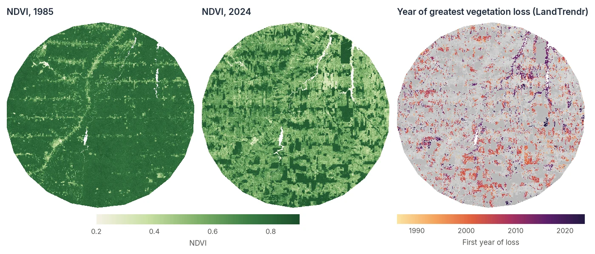
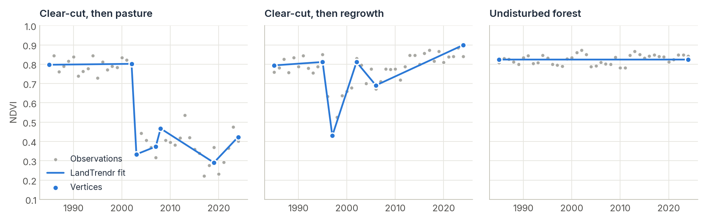

# LandTrendr

<p class="lead">Map when forests were cleared, burned or degraded, how severe each event was, and whether they recovered, from one satellite image per year.</p>

<div class="glance" markdown>
<div><span class="k">Answers</span><span class="v">When did this pixel change, by how much, and how fast?</span></div>
<div><span class="k">Input</span><span class="v">One spectral index, one value per year: <code>(time, rows, cols)</code></span></div>
<div><span class="k">Output</span><span class="v">Fitted vertices per pixel, then maps of year, magnitude and duration</span></div>
<div><span class="k">Reference</span><span class="v">Kennedy et al. (2010), ported from the original IDL</span></div>
</div>

<figure markdown>
  
  <figcaption><strong>Result of this tutorial.</strong> 40 years of annual Landsat NDVI over a 50 km area of Rondônia, Brazil. Left and middle: the landscape before and after. Right: the first year of the largest abrupt vegetation loss in each pixel, as found by LandTrendr and filtered as in steps 3 and 4. Only one event is shown per pixel, and gray does not always mean intact forest. Clearings where NDVI fell slowly, or stayed high as pasture, often have no event that passes the filters: here only about a third of the pixels that went from forest to open land are colored. The whole area, 2.8 million pixels, was segmented in about 5 seconds. <em>Data: annual Landsat NDVI composites exported from <a href="https://github.com/eMapR/LT-GEE">LT-GEE</a> on Google Earth Engine.</em></figcaption>
</figure>

## How LandTrendr works

A yearly satellite series is noisy. Clouds, haze, sun angle and a dry year all make the values wobble. LandTrendr looks past that noise by approximating each pixel's history with a few **straight line segments**. The corners between segments are called **vertices**, and each segment has a clear meaning:

- a flat segment is a **stable** period;
- a steep drop is an **abrupt disturbance** (clear-cut, fire);
- a slow decline is **degradation** (drought, disease, selective logging);
- a rise is **recovery** or regrowth.

<figure markdown>
  
  <figcaption>Three real pixels from the map above. Grey dots are the yearly NDVI values. Blue lines are LandTrendr's segments, and blue dots are the vertices. The same algorithm tells a permanent conversion, a clearing that regrew, and stable forest apart.</figcaption>
</figure>

For each pixel the algorithm removes one-year spikes, proposes candidate vertices where the series bends most, and fits models with fewer and fewer segments. It keeps the simplest model that still fits the data well (judged by an F-test p-value). You control how many segments are allowed and how strict the test is.

## Step by step

### 1. Prepare an annual index stack

LandTrendr needs **one value per pixel per year**, usually a cloud-free composite of the growing season. Good choices:

- **NBR** (Normalized Burn Ratio): the most sensitive to canopy loss and fire. The standard for forests.
- **NDVI**: easy to interpret, good for agriculture and savanna, less sensitive to structural forest change.
- **Tasseled Cap Wetness**: robust for forest structure.

Store it as a GeoTIFF with one band per year. [Google Earth Engine](gee-downloads.md) (`composite_type="annual"`) and [STAC cubes](stac-downloads.md) with `regularize_time_series(freq="1YS")` both produce this. So does [LT-GEE](https://github.com/eMapR/LT-GEE): the stack used on this page is an NDVI composite collection exported from LT-GEE, so an existing LT-GEE workflow can move to local processing with Zeit unchanged.

```python
import numpy as np
import zeit

stack, profile = zeit.io.load_raster("ndvi_1985_2024.tif", raster_check="landtrendr")
years = np.arange(1985, 1985 + stack.shape[0])

print(stack.shape)   # (40, 1671, 1686) -> (years, rows, cols)
```

`raster_check="landtrendr"` warns you if the stack looks wrong, for example too few years.

### 2. Segment every pixel

```python
vertices, rmse = zeit.run_landtrendr_array(
    years,
    stack.astype(np.float32),
    max_segments=6,      # at most 6 segments, 7 vertices
    modifier=-1.0,       # we are looking for DROPS in NDVI
    return_rmse=True,    # also return each pixel's fit error
)
```

!!! warning "Set `modifier` to match your index"
    LandTrendr's rules are asymmetric: it treats sudden changes in one direction as disturbance and in the other as recovery. Use **`modifier=-1.0`** when disturbance makes your index **fall** (NDVI, NBR, EVI, wetness) and the default **`+1.0`** when it makes the index **rise** (SWIR bands, brightness). With the wrong orientation, about three quarters of the pixels in this tutorial's Rondônia data get different vertex years.

The result is a `(14, rows, cols)` array. With `max_segments=6` there are up to 7 vertices:

- bands `0–6` hold the vertex **years** (`0` for unused slots);
- bands `7–13` hold the fitted **values** at those years.

`rmse` is a `(rows, cols)` map of how well each fit follows its data. It is used below to separate real events from noise.

### 3. Extract disturbance maps

`extract_events` reads the vertices and returns one event per pixel as a set of maps:

```python
loss = zeit.extract_events(
    vertices,
    event_type="loss",      # "loss" (index fell) or "gain" (index rose)
    sort_by="greatest",     # which event to keep if there are several
    min_magnitude=2000,     # ignore drops smaller than 0.2 NDVI (data is x10000)
    min_duration=1,
    rmse_map=rmse,          # enables the "dsnr" output below
)

loss.keys()
# dict_keys(['yod', 'magnitude', 'duration', 'pre_val', 'post_val', 'rate', 'dsnr'])
```

| Map | Meaning |
| :--- | :--- |
| `yod` | Year of the vertex where the loss begins, i.e. the **last year before the drop** (`0` = no event). The first year in which the loss is visible is `yod + 1`. |
| `magnitude` | Size of the drop, in the units of your data. |
| `duration` | Years the drop took. `1` is abrupt, larger values are gradual. |
| `pre_val`, `post_val` | Fitted value before and after. |
| `rate` | `magnitude / duration`. |
| `dsnr` | Magnitude divided by the fit's RMSE: a signal-to-noise ratio. Values above 2–3 are rarely noise. |

`sort_by` chooses among several losses in the same pixel: `"greatest"` (largest magnitude), `"newest"`, `"fastest"`, `"longest"`, or `"dsnr"`.

### 4. Clean up and save

Keep confident events, then write GeoTIFFs:

```python
# yod == years[0] means the loss segment starts at the first year. On noisy
# NDVI that is usually a slow decline over the whole record, not a dated event.
confident = (loss["yod"] > years[0]) & (loss["dsnr"] >= 3)
first_year = np.where(confident, loss["yod"] + 1, 0).astype("uint16")

zeit.save_raster(first_year, "results/loss_year.tif",
                 crs=profile["crs"], transform=profile["transform"], nodata=0)
zeit.save_raster(np.where(confident, loss["magnitude"], 0).astype("float32"),
                 "results/loss_magnitude.tif",
                 crs=profile["crs"], transform=profile["transform"], nodata=0)
```

Isolated single pixels are usually noise. A **minimum mapping unit** filter removes patches smaller than a given size:

```python
zeit.apply_mmu_filter("results/loss_year.tif", "results/loss_year_mmu.tif", mmu_pixels=11)
```

The map at the top of this page uses exactly these steps: no event starting in the first year, `dsnr >= 3` and an 11-pixel minimum mapping unit.

### 5. Inspect individual pixels

Plotting a few pixels is the best way to check your parameters:

```python
import matplotlib.pyplot as plt

row, col = 1471, 819   # the "clear-cut, then pasture" pixel shown above
n_v = vertices.shape[0] // 2
v_years, v_values = vertices[:n_v, row, col], vertices[n_v:, row, col]
used = v_years > 0

plt.scatter(years, stack[:, row, col], color="grey", label="Observed")
plt.plot(v_years[used], v_values[used], "o-", label="LandTrendr fit")
plt.legend()
plt.show()
```

For a single series you can also call the pixel-level function directly. It returns the vertices as a list of dicts:

```python
from zeit.landtrendr import run_landtrendr

run_landtrendr(years, stack[:, row, col], modifier=-1.0)
# values rounded for display:
# [{'year': 1985, 'value': 7972}, {'year': 2002, 'value': 8018}, {'year': 2003, 'value': 3333},
#  {'year': 2007, 'value': 3734}, {'year': 2008, 'value': 4670}, {'year': 2019, 'value': 2903},
#  {'year': 2024, 'value': 4230}]
```

### 6. Fit other bands to the same vertices

A classic LandTrendr trick is to segment on one index (say NBR) and then describe the same periods with other bands. This is known as *fitting to vertices* (FTV). `apply_vertices` does this per pixel:

```python
from zeit.landtrendr import apply_vertices

# Vertex years found on the primary index for this pixel (step 5)...
vertex_years = v_years[used]

# ...applied to another band of the same pixel, e.g. SWIR1 from a second stack
ftv_swir = apply_vertices(vertex_years, years, swir_stack[:, row, col])
# [{'year': 1985, 'value': ...}, {'year': 2002, 'value': ...}, ...]
```

## Tuning the parameters

The defaults follow the original LandTrendr and work well for 25–40 years of Landsat data.

| Parameter | Default | Effect |
| :--- | :---: | :--- |
| `max_segments` | `6` | Maximum segments per pixel. Lower it for short series (about `n_years / 5`). Too high a value lets noise become "events". |
| `spike_threshold` | `0.9` | Dampens one-year spikes before fitting. `1.0` disables it. Lower values remove spikes more aggressively. |
| `recovery_threshold` | `0.25` | Rejects recoveries faster than 1/value years (0.25 = at least 4 years to recover fully). Stops a cloudy year from looking like disturbance and instant recovery. |
| `pval_threshold` | `0.05` | A model must be at least this significant. Lower values give simpler fits. |
| `best_model_proportion` | `0.75` | Prefers models with more vertices whose p-value is at most `(2 - best_model_proportion)` times the best one, so `0.75` means within 1.25×. |
| `min_observations_needed` | `6` | Pixels with fewer valid years are left unsegmented. |
| `no_data_value` | `0.0` | Values treated as missing (NaN is always missing). |

## Processing large areas

**GeoTIFFs larger than memory.** `run_landtrendr_image` reads the file in blocks, runs the steps above on each block, and writes one GeoTIFF per output map. The orientation (`modifier`) is chosen automatically from `event_type`:

```python
zeit.run_landtrendr_image(
    "ndvi_1985_2024.tif", "results/",
    start_year=1985,
    event_type="loss",
    min_mag=2000,
    chunk_size=512,
)
# results/lt_event_yod.tif, lt_event_magnitude.tif, lt_event_duration.tif, ...
```

The same is available from the shell as [`zeit landtrendr`](../cli.md#1-landtrendr-landtrendr).

**Dask cubes and clusters.** For lazy xarray cubes (for example from STAC or Zarr) use the `.zeit` accessor. Keep the time axis in one chunk:

```python
import zeit

annual = annual_ndvi.chunk({"time": -1, "y": 512, "x": 512})   # (time, y, x)

# The accessor runs with the default modifier (+1), so flip the index
# to make a vegetation loss look like a rise, then ask for "gain" events.
vertices = (-annual).zeit.run_landtrendr(years=years, max_segments=6).compute()
loss = zeit.extract_events(vertices.values, event_type="gain", min_magnitude=0.2)
# loss["pre_val"] and loss["post_val"] are negated NDVI here; flip them back if needed.
```

Negating the index is the traditional LandTrendr convention and gives exactly the same vertices as `modifier=-1.0`. See [Parallel & Cloud Processing](parallel-cloud-processing.md) to run this on a cluster.

## Good practice

- **Use a stable season.** Composite the same months every year, so phenology is not mistaken for change.
- **Mask clouds before compositing.** Residual clouds create spikes. `spike_threshold` removes most of them, but clean input always wins.
- **Validate on the ground truth you have.** `zeit.generate_landtrendr_accuracy_dashboard` builds an interactive HTML page to review points against image chips (see the [API reference](../api/post-processing.md)).
- **Compare with the published method.** Zeit reproduces the original IDL LandTrendr vertex for vertex, see [Algorithm Fidelity](../benchmarks/fidelity.md#1-landtrendr-kennedy-et-al-2010).

## References

- Kennedy, R. E., Yang, Z., & Cohen, W. B. (2010). Detecting trends in forest disturbance and recovery using yearly Landsat time series: 1. LandTrendr — Temporal segmentation algorithms. *Remote Sensing of Environment*, 114(12), 2897–2910. [doi:10.1016/j.rse.2010.07.008](https://doi.org/10.1016/j.rse.2010.07.008)
- Kennedy, R. E., et al. (2018). Implementation of the LandTrendr algorithm on Google Earth Engine. *Remote Sensing*, 10(5), 691. [doi:10.3390/rs10050691](https://doi.org/10.3390/rs10050691)
- LT-GEE code and guide: [github.com/eMapR/LT-GEE](https://github.com/eMapR/LT-GEE)
