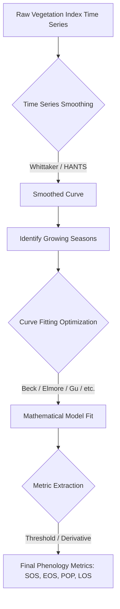

# Phenology Extraction

The `cdts` package features an incredibly fast and highly optimized C++ backend for **Phenology Extraction**, designed specifically to handle large-scale Earth Observation datasets. This module allows you to monitor and extract cyclical patterns in vegetation dynamics—essential for agriculture, forestry, and climate change studies.

Built heavily on robust concepts adapted from state-of-the-art tools (like the R package `phenofit`), our implementation leverages **Eigen** for sparse linear algebra and **OpenMP** for native multi-threading. This allows the extraction of land surface phenology metrics from gigabytes of satellite time series with unparalleled speed, bypassing the Python Global Interpreter Lock (GIL).

---

## 1. What is Land Surface Phenology?

Phenology is the study of periodic biological events in the animal and plant world as influenced by the environment, especially seasonal variations in temperature and precipitation. In remote sensing, **Land Surface Phenology (LSP)** refers to the seasonal pattern of variation in vegetated land surfaces observed from satellite imagery.

By analyzing vegetation indices (such as EVI or NDVI) over time, we can extract key phenological metrics:

- **SOS (Start of Season)**: The start of the vegetative cycle (e.g., spring green-up or planting).
- **POP (Peak of Season)**: The moment of maximum vegetative vigor (maximum canopy closure).
- **EOS (End of Season)**: The end of the vegetative cycle (senescence or harvesting).
- **LOS (Length of Season)**: The duration of the growing season, calculated as `EOS - SOS`.

These metrics are crucial for mapping crop types, predicting yields, detecting climate-induced shifts in ecosystems, and monitoring double-cropping agricultural systems.

---

## 2. The Extraction Workflow

Extracting phenology from noisy, cloud-contaminated satellite time series requires a robust, multi-step mathematical pipeline.



### 2.1. Time Series Smoothing

Raw satellite data is often noisy due to atmospheric interference, clouds, or sensor errors. The first step is to smooth the curve to extract the general seasonal trend.
- **Whittaker Smoother**: We use a highly optimized Sparse Matrix implementation of the Whittaker smoother. It balances fidelity to the original data with the smoothness of the resulting curve, controlled by a `lambda` parameter.
- **HANTS (Harmonic Analysis of Time Series)**: An alternative smoothing method that models the time series using sine and cosine waves (Fourier analysis), which is highly effective at removing cloud gaps.

### 2.2. Curve Fitting (Levenberg-Marquardt)

Once the general shape of the growing season is identified, we fit a mathematical model to it. This allows us to continuously evaluate the curve at any given day. The optimization is done using the **Levenberg-Marquardt** non-linear least squares algorithm.

We provide several asymmetric Gaussian and double-logistic functions:
- **`BECK` (Beck et al., 2006)**: Excellent for general forest and crop phenology.
- **`ELMORE` (Elmore et al., 2012)**: Handles varying winter backgrounds effectively.
- **`GU` (Gu et al., 2009)**: Uses an advanced recovery model.
- **`KLOSTERMAN` (Klosterman et al., 2014)**: Uses analytical geometry to detect transition dates.
- **`ZHANG` (Zhang et al., 2003)**: A piecewise logistic model.
- **`AG`**: Standard Asymmetric Gaussian.
- **`DL`**: Standard Double Logistic.

### 2.3. Metric Extraction Methods

Once the curve is fitted perfectly, how do we define the "Start" and "End" of the season? We provide two industry-standard methods:

1. **`THRESHOLD` (Amplitude Ratio)**: SOS and EOS are defined as the days when the curve reaches a certain percentage (e.g., 20% or 50%) of its seasonal amplitude.
2. **`DERIVATIVE` (Maximum Curvature)**: Mathematically more robust. SOS is defined as the point where the rate of change of the curve (the derivative) reaches its local maximum (spring green-up acceleration), and EOS where the derivative reaches its local minimum (senescence deceleration).

---

## 3. Practical Example: Processing a Raster (End-to-End)

The `cdts` package natively integrates with `xarray` through a custom accessor (`.cdts.run_phenology`). This abstracts away all the complex array reshaping and memory management, allowing you to process large MODIS/Landsat time series elegantly.

```python
import rioxarray
import numpy as np
import pandas as pd
import cdts # Automatically registers the .cdts accessor in xarray
from cdts.io import save_raster

# 1. Load the dense time series raster (Shape: Time, Y, X)
ds = rioxarray.open_rasterio('MODIS_EVI_Series.tif')

# 2. Prepare the Time Array (Continuous Day of Year)
dates = pd.date_range(start='2001-01-01', periods=ds.shape[0], freq='16D')
dates_doy = np.array([d.timetuple().tm_yday + (d.year - 2001) * 365 for d in dates], dtype=np.float64)

# 3. Run the Phenology Engine directly on the xarray DataArray
# This leverages Dask internally for parallel out-of-core execution
print("Extracting phenology metrics...")
metrics_da = ds.cdts.run_phenology(
    dates=dates_doy,
    curve_type=1,             # 1 = BECK
    extraction_method=2,      # 2 = DERIVATIVE
    max_seasons=1,            # Extract the main season per pixel
    whittaker_lambda=2.0,     # Whittaker smoothness parameter
    apply_whittaker=True,     # Apply Whittaker before fitting
    min_season_length=3,      # A season must last at least 3 days
    min_pixel_amplitude=0.01, # Skip dead/water pixels entirely
    n_jobs=-1                 # Use 100% of CPU cores (OpenMP)
)

# 4. Save to disk using the native io helper
# metrics_da shape is (metric, max_seasons, y, x). 
# We slice metric[:] and max_seasons[0] to get a 3D array (4 bands, Y, X)
output_array = metrics_da.values[:, 0, :, :]

save_raster(
    array=output_array,
    output_path='MODIS_Phenology_Metrics.tif',
    reference_cube=ds,
    nodata=np.nan # Enforce transparency for NoData in GIS
)
print("Successfully saved!")
```

---

## 5. Advanced Configuration & Double Cropping

### Multiple Seasons (Double/Triple Cropping)
In regions with intense agricultural activity (like Mato Grosso, Brazil), a single pixel might feature two or even three distinct crop harvests within a single year (e.g., Soybeans followed by Corn).

To capture these dynamics, simply increase `max_seasons`:
```python
sos, eos, los, pop = core.phenology.fit_phenology_batch(
    # ...
    max_seasons=3, 
    # ...
)
```
This returns arrays of shape `(n_pixels, 3)`. You can then map `sos[:, 0]` as the first harvest, `sos[:, 1]` as the second (safrinha), and so on.

### Adjusting Quality Control Parameters
- **`whittaker_lambda`**: Higher values create stiffer, smoother curves. Lower values allow the curve to bend sharply to follow the raw data closely. For 16-day composites, values between `1.0` and `5.0` are standard.
- **`min_season_length`**: Useful for filtering out high-frequency noise spikes that mistakenly look like a very short 2-day growing season.
- **`min_amplitude`**: Prevents the optimizer from fitting curves on background noise (e.g., bare soil that fluctuates slightly with rain). If the peak of the smoothed curve minus the base is less than this value, the season is rejected.

---

## 6. Execution Performance

The `cdts` phenology engine is engineered to maximize performance:
1. **No GIL**: The `fit_phenology_batch` completely releases the Python Global Interpreter Lock.
2. **OpenMP C++**: Pixel loops are chunked and scheduled dynamically across all logical CPU cores.
3. **No Dynamic Allocation**: Temporary vectors inside the optimization loop are pre-allocated and map directly to memory via Eigen.

**Operating System Notes:**
- **Windows / Linux**: OpenMP multi-threading works perfectly out of the box with `pip install cdts`.
- **macOS (Apple Silicon / Intel)**: Apple's default Clang compiler disables OpenMP. To achieve maximum performance, install the library (`brew install libomp`) and export the compilation flags *before* installing the package:
  ```bash
  export CFLAGS="-I$(brew --prefix libomp)/include"
  export CXXFLAGS="-I$(brew --prefix libomp)/include"
  export LDFLAGS="-L$(brew --prefix libomp)/lib -lomp"
  pip install cdts
  ```
