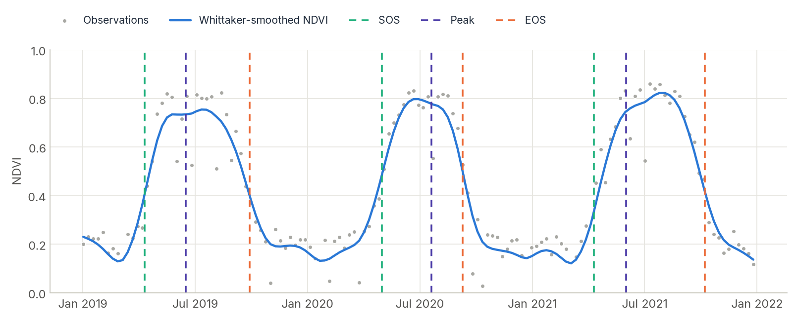
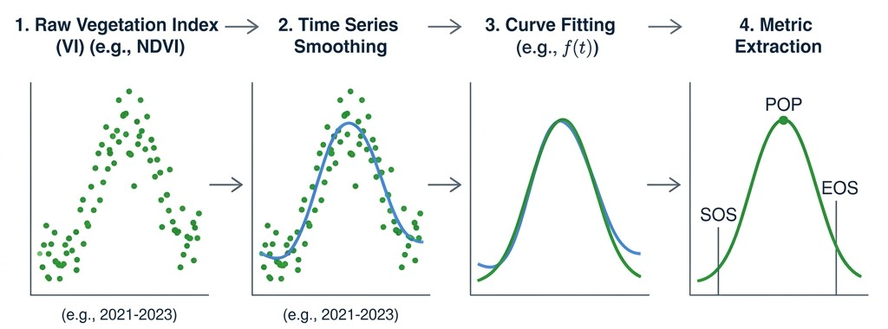

# Phenology

<p class="lead">Extract the calendar of the growing season for every pixel and every year: when green-up starts, when it peaks, when it ends, and how long it lasts. Use it to map crop calendars, detect late planting or drought, find double cropping, or follow climate-driven shifts in vegetation.</p>

<div class="glance" markdown>
<div><span class="k">Answers</span><span class="v">When does the season start, peak and end? Is this year different?</span></div>
<div><span class="k">Input</span><span class="v">A dense vegetation-index series (8- or 16-day), optional QA weights</span></div>
<div><span class="k">Output</span><span class="v">19 phenology metrics plus fit quality, per season and pixel</span></div>
<div><span class="k">Reference</span><span class="v">Methodology of the R package <code>phenofit</code> (Kong et al., 2022)</span></div>
</div>

<figure markdown>
  
  <figcaption><strong>What phenology extraction produces.</strong> Three years of an 8-day NDVI series with noise and cloud drops. For each season, Zeit finds the start (SOS, 50% of the amplitude), the peak and the end (EOS). The shifts between years, such as the later start in 2020, are exactly what anomaly analyses look for.</figcaption>
</figure>

## How it works

Raw index series are noisy and gappy, so metrics are not read from the raw points. The pipeline runs four steps per pixel:

<figure markdown>
  
</figure>

1. **Smooth** the series with a Whittaker smoother (or HANTS harmonics) to fill gaps and damp noise. `whittaker_lambda` sets the stiffness.
2. **Split** it into seasons, one per trough-to-trough cycle. Double and triple cropping produce several seasons per year.
3. **Fit** a smooth parametric curve to each season with Levenberg-Marquardt least squares. The curve is re-weighted iteratively so that low outliers (clouds) pull it less.
4. **Extract** the transition dates from the fitted curve with several methods at once.

Available curves (`curve_type`, from `zeit._core.phenology.CurveType`):

| Curve | Notes |
| :--- | :--- |
| `BECK` | Double logistic of Beck et al. (2006). A good general default. |
| `ELMORE` | Double logistic with a summer green-down term (Elmore et al., 2012). |
| `GU` | Gu et al. (2009), flexible asymmetric shape. |
| `KLOS` | Klosterman et al. (2014). |
| `ZHANG` | Piecewise logistic (Zhang et al., 2003). |
| `AG` | Asymmetric Gaussian. |
| `DL` | Plain double logistic. |

## The 19 metrics

Every method below is computed from the same fitted curve, at no extra cost. All dates are days of the year.

| Family | Metrics | Definition |
| :--- | :--- | :--- |
| Threshold | `TRS2.sos`, `TRS2.eos` | Curve crosses 20% of the seasonal amplitude (rising, falling). |
| | `TRS5.sos`, `TRS5.eos` | Crosses 50%. A robust default for start and end of season. |
| | `TRS6.sos`, `TRS6.eos` | Crosses 60%. |
| Derivative | `DER.sos`, `DER.eos` | Fastest green-up and fastest senescence (extremes of the first derivative). |
| | `DER.pos` | Peak of the season (first derivative is zero). |
| Gu | `UD`, `SD`, `DD`, `RD` | Upturn, stabilisation, downturn and recession dates, from the second derivative. |
| Zhang | `Greenup`, `Maturity`, `Senescence`, `Dormancy` | Extremes of the rate of change of curvature. |
| General | `LOS` | Length of season in days. |
| | `POP` | Position of the peak. |

Two quality metrics, `R2` and `RMSE` of the fitted curve, follow the 19 phenology metrics, so the output has 21 entries along the `metric` axis.

## Processing a raster

The `zeit` package natively integrates with `xarray` through a custom accessor (`.zeit.run_phenology`). This abstracts away all the complex array reshaping and memory management, allowing you to process large MODIS/Landsat time series elegantly.

By default, the pipeline automatically maps the continuous days back into calendar DOYs if you pass `return_annual=True`.

```python
import rioxarray
import numpy as np
import pandas as pd
import zeit # Automatically registers the .zeit accessor in xarray
from zeit._core.phenology import CurveType

# 1. Load the dense time series raster (Shape: Time, Y, X)
ds = rioxarray.open_rasterio('MODIS_EVI_Series.tif')

# 2. Prepare the Time Array (Continuous Day of Year)
dates = pd.date_range(start='2001-01-01', periods=ds.shape[0], freq='16D')
dates_doy = np.array([d.timetuple().tm_yday + (d.year - 2001) * 365 for d in dates], dtype=np.float64)

# 3. Run the Phenology Engine directly on the xarray DataArray
# This leverages Dask internally for parallel out-of-core execution
print("Extracting 19 phenology metrics...")
metrics_da = ds.zeit.run_phenology(
    dates=dates_doy,
    curve_type=int(CurveType.BECK), # Use Beck's double logistic
    max_seasons=25,                 # Process 25 years of data
    whittaker_lambda=10.0,          # Whittaker smoothness parameter
    apply_whittaker=True,           # Apply Whittaker before fitting
    min_season_length=7,            # A season must last at least 7 days
    min_amplitude=0.0,              
    min_pixel_amplitude=0.1,        # Skip dead/water pixels entirely
    return_annual=True,             # Return variables aligned to calendar Years
    base_year=2001,
    n_jobs=14                       # Use 14 CPU cores (OpenMP)
).compute()

# 4. Save to disk using rioxarray
# metrics_da shape is (metric=21, year=25, y, x): 19 metrics + R2 + RMSE.
# Export each metric as a 25-band GeoTIFF, one band per year
metrics_da.rio.write_crs(ds.rio.crs, inplace=True)

for metric_name in metrics_da.metric.values:
    # Select the specific metric, resulting in a 3D array (year, y, x)
    single_metric_da = metrics_da.sel(metric=metric_name)
    
    # Save a multi-band TIF where each band is a year
    filename = f"zeit_{metric_name}.tif"
    single_metric_da.rio.to_raster(filename)
    print(f"Saved {filename}")
```

## Worked example: late planting in soybean fields

This section walks through a complete, realistic problem end-to-end: **an analyst wants to know whether soybean fields in a Mato Grosso municipality (Brazil) show anomalously delayed green-up in a candidate drought year, compared to a multi-year baseline** — a common early-warning question for agricultural monitoring and drought impact assessment. Late green-up (a positive SOS anomaly, in days) is a classic remote signal of delayed planting caused by late onset of the rainy season.

The workflow chains three `zeit` building blocks: `build_time_series` (STAC ingestion) → `regularize_time_series` (temporal regularization) → `.zeit.run_phenology` (metric extraction), all lazy until `.compute()` is called — so it scales from a single tile to a whole state without changing the code.

### Step 1 — Build a multi-year Sentinel-2 cube for the area of interest

```python
import numpy as np
import pandas as pd
import matplotlib.pyplot as plt
import zeit
from zeit import regularize_time_series
from zeit._core.phenology import CurveType

# Multi-year window covering the baseline + the candidate drought year (2021)
cube_raw = zeit.build_time_series(
    source="earth_search",
    collection="sentinel-2-l2a",
    tiles=["21LWH"],              # A Sentinel-2 MGRS tile over Mato Grosso cropland
    start_date="2019-07-01",
    end_date="2022-06-30",        # 3 full crop years: 2019/20, 2020/21, 2021/22
    bands=["red", "nir"],
    apply_cloud_mask=True,        # Drops clouds/shadows using the SCL band automatically
)
```

### Step 2 — Compute NDVI and regularize to 16-day composites

Phenology curve-fitting expects a reasonably dense, evenly-spaced time axis — raw STAC revisits are irregular (5–12 days, with cloud gaps). We compute NDVI first (single-band, so `method="median"` is the right choice — `medoid` needs a `band` dimension to compare against) and then regularize:

```python
ndvi_raw = (cube_raw.sel(band="nir") - cube_raw.sel(band="red")) / (
    cube_raw.sel(band="nir") + cube_raw.sel(band="red")
)

ndvi_16d = regularize_time_series(ndvi_raw, freq="16D", method="median")
```

### Step 3 — Run the phenology engine across all three crop years at once

```python
# Build the continuous day-numbering the C++ core expects: days since `base_year`-01-01.
dates_pd = pd.to_datetime(ndvi_16d.time.values)
base_year = int(dates_pd.year.min())
dates_doy = np.array(
    [d.timetuple().tm_yday + (d.year - base_year) * 365 for d in dates_pd],
    dtype=np.float64,
)
n_years = int(dates_pd.year.max()) - base_year + 1

pheno = ndvi_16d.zeit.run_phenology(
    dates=dates_doy,
    curve_type=int(CurveType.BECK),
    max_seasons=n_years,        # one slot per calendar year in the window
    apply_whittaker=True,
    whittaker_lambda=5.0,       # a bit looser than default: S2 NDVI is noisier than MODIS
    min_season_length=45,       # ignore green-ups shorter than ~45 days (noise, not a crop cycle)
    min_amplitude=0.15,
    min_pixel_amplitude=0.15,   # skip forest/water/urban pixels entirely — huge speedup at scale
    return_annual=True,         # aligns each detected season to a calendar year
    base_year=base_year,
    n_jobs=-1,
).compute()
```

### Step 4 — Compute the SOS anomaly for the candidate drought year

We use `DER.sos` (derivative-based Start of Season — see [the 19 metrics](#the-19-metrics)) and compare the target year against the mean of the other years in the window:

```python
sos = pheno.sel(metric="DER.sos")   # dims: (year, y, x), values in day-of-year

target_year = 2021
baseline_years = [y for y in sos.year.values if y != target_year]

baseline_mean_sos = sos.sel(year=baseline_years).mean(dim="year", skipna=True)
target_sos = sos.sel(year=target_year)

# Positive = later green-up than the baseline (a delayed-planting / drought signal)
sos_anomaly_days = target_sos - baseline_mean_sos
```

### Step 5 — Visualize and export

```python
fig, ax = plt.subplots(figsize=(8, 6))
sos_anomaly_days.plot(
    ax=ax, cmap="RdBu_r", vmin=-30, vmax=30,
    cbar_kwargs={"label": "SOS anomaly (days, + = later green-up)"},
)
ax.set_title(f"Planting Delay Anomaly — {target_year} vs. {baseline_years} baseline")
plt.savefig("sos_anomaly_2021.png", dpi=150, bbox_inches="tight")

# Export as a GeoTIFF for use in QGIS or further zonal statistics
sos_anomaly_days.rio.write_crs(ndvi_16d.rio.crs, inplace=True)
sos_anomaly_days.rio.to_raster(f"sos_anomaly_{target_year}.tif")
```

### Interpreting the result

- **Anomaly > +15 days**: green-up notably delayed relative to the baseline — worth cross-checking against rainfall onset records for that season; a classic drought/late-planting signal.
- **Anomaly < -15 days**: notably earlier green-up — can indicate irrigation, an earlier-maturing cultivar, or a shift toward double-cropping.
- **`NaN` pixels**: no season passed the `min_amplitude` / `min_season_length` filters in at least one of the years being compared (e.g., fallow land, pasture, or a rotation year) — `xarray`'s alignment propagates this automatically, no special handling needed.
- This is a **remote-sensing signal, not ground truth** — always validate against field records or known planting calendars before drawing operational conclusions.

Because every step here (`build_time_series`, `regularize_time_series`, `run_phenology`) is Dask-backed, the exact same code scales from one MGRS tile to an entire state or country simply by widening `bbox`/`tiles` — only the chunk count (and wall-clock time) changes.

## Advanced configuration

### Double and triple cropping
In regions with intense agricultural activity (like Mato Grosso, Brazil), a single pixel might feature two or even three distinct crop harvests within a single year (e.g., Soybeans followed by Corn).

To capture these dynamics directly without `return_annual=True`, simply increase `max_seasons`:
```python
metrics_tensor = ds.zeit.run_phenology(
    # ...
    max_seasons=3,
    return_annual=False
    # ...
)
```
This returns arrays of shape `(19_metrics, 3_seasons, Y, X)`. You can then map `season=0` as the first harvest, `season=1` as the second (safrinha), and so on.

### Quality-control parameters
- **`whittaker_lambda`**: Higher values create stiffer, smoother curves. Lower values allow the curve to bend sharply to follow the raw data closely. For 16-day composites, values between `1.0` and `5.0` are standard.
- **`min_season_length`**: Useful for filtering out high-frequency noise spikes that mistakenly look like a very short 2-day growing season. Measured in the same calendar-day units as `dates`, not in observation count — it is compared against the actual elapsed time between a season's start and end, so it behaves consistently regardless of the sensor's revisit cadence.
- **`min_amplitude`**: Prevents the optimizer from fitting curves on background noise (e.g., bare soil that fluctuates slightly with rain). If the peak of the smoothed curve minus the base is less than this value, the season is rejected.

### Down-weighting low-quality observations
Cloud, cloud-shadow, and snow contamination can distort the smoothed curve even after masking obvious no-data pixels. `zeit.qc` decodes a sensor's native QA/QC band into per-observation reliability weights in `[0, 1]`, which then feed both the Whittaker/HANTS smoother and the iterative curve-fit reweighting (`wTSM`) — low-quality observations pull the fit less instead of being treated as equally trustworthy as clear ones:

```python
from zeit.qc import qc_modis_summary, qc_modis_state, qc_sentinel2_scl

# MOD13A1/A2/Q1 "SummaryQA" band (0=good, 1=marginal, 2=snow/ice, 3=cloudy)
weights = qc_modis_summary(qa_cube)  # -> [1.0, 0.5, 0.2, 0.2], aligned with qa_cube

pheno_results = ds.zeit.run_phenology(
    dates=dates_julian,
    curve_type=int(CurveType.BECK),
    weights=weights,        # (time, y, x), aligned with the input DataArray
    season_retry=True,      # default: relax the trough threshold once if a
                             # pixel's first pass finds no season at all
)
```

`qc_modis_state` (MOD09 500m 16-bit "State QA": cloud state, cloud shadow, aerosol quantity, snow/ice) and `qc_sentinel2_scl` (Sentinel-2 L2A Scene Classification Layer) follow the same `[0, 1]` convention for their respective sensors. All three are ports of phenofit's `qcFUN.R` (see [References](#references)).

## Performance

The whole pipeline runs in C++ (Eigen and OpenMP) outside the Python GIL, with buffers allocated once per thread. On a real 25-year EVI raster it was 244 times faster than R `phenofit` on one core, with a mean start-of-season difference of 3.7 days. See [Benchmarks](../benchmarks/fidelity.md#4-phenology-extraction-vs-r-phenofit).

On macOS, the pre-built wheels run single-threaded. See [Installation](../getting-started/installation.md#enabling-openmp-on-macos-apple-silicon-intel) to enable OpenMP.

## References

The methodology of this module — the smoothing methods, the iterative curve-fitting scheme, and the simultaneous multi-method metric extraction — is based on the R package **`phenofit`**:

- Kong, D., McVicar, T. R., Xiao, M., Zhang, Y., Peña-Arancibia, J. L., Filippa, G., Xie, Y., & Gu, X. (2022). *phenofit*: An R package for extracting vegetation phenology from time series remote sensing. **Methods in Ecology and Evolution**, 13(7), 1508–1527. [https://doi.org/10.1111/2041-210X.13870](https://doi.org/10.1111/2041-210X.13870)

The individual curve-fitting models and extraction methods available via `curve_type` and `extraction_method` (Section 2) originate from:

- Beck, P. S. A., Atzberger, C., Høgda, K. A., Johansen, B., & Skidmore, A. K. (2006). Improved monitoring of vegetation dynamics at very high latitudes: A new method using MODIS NDVI. **Remote Sensing of Environment**, 100(3), 321–334. [https://doi.org/10.1016/j.rse.2005.10.021](https://doi.org/10.1016/j.rse.2005.10.021)
- Zhang, X., Friedl, M. A., Schaaf, C. B., Strahler, A. H., Hodges, J. C. F., Gao, F., Reed, B. C., & Huete, A. (2003). Monitoring vegetation phenology using MODIS. **Remote Sensing of Environment**, 84(3), 471–475. [https://doi.org/10.1016/S0034-4257(02)00135-9](https://doi.org/10.1016/S0034-4257(02)00135-9)
- Gu, L., Post, W. M., Baldocchi, D. D., Black, T. A., Suyker, A. E., Verma, S. B., Vesala, T., & Wofsy, S. C. (2009). Characterizing the seasonal dynamics of plant community photosynthesis across a range of vegetation types. In A. Noormets (Ed.), *Phenology of Ecosystem Processes* (pp. 35–58). Springer. [https://doi.org/10.1007/978-1-4419-0026-5_2](https://doi.org/10.1007/978-1-4419-0026-5_2)
- Elmore, A. J., Guinn, S. M., Minsley, B. J., & Richardson, A. D. (2012). Landscape controls on the timing of spring, autumn, and growing season length in mid-Atlantic forests. **Global Change Biology**, 18(2), 656–674. [https://doi.org/10.1111/j.1365-2486.2011.02521.x](https://doi.org/10.1111/j.1365-2486.2011.02521.x)
- Klosterman, S. T., Hufkens, K., Gray, J. M., Melaas, E., Sonnentag, O., Lavine, I., Mitchell, L., Norman, R., Friedl, M. A., & Richardson, A. D. (2014). Evaluating remote sensing of deciduous forest phenology at multiple spatial scales using PhenoCam imagery. **Biogeosciences**, 11(16), 4305–4320. [https://doi.org/10.5194/bg-11-4305-2014](https://doi.org/10.5194/bg-11-4305-2014)
