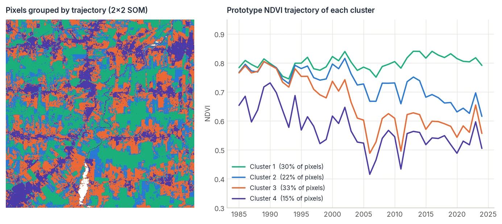

# Clustering (SOM)

<p class="lead">Find the main types of behaviour in a landscape without any labels. A self-organizing map groups millions of pixel trajectories into a small grid of prototypes, each one a typical time series, arranged so that similar prototypes sit next to each other.</p>

<div class="glance" markdown>
<div><span class="k">Answers</span><span class="v">Which typical trajectories exist here, and where?</span></div>
<div><span class="k">Input</span><span class="v">A 2-D array of samples × features (e.g. pixels × dates)</span></div>
<div><span class="k">Output</span><span class="v">Prototype vectors and the best-matching prototype of each pixel</span></div>
<div><span class="k">Reference</span><span class="v">Kohonen (1990), batch SOM</span></div>
</div>

<figure markdown>
  
  <figcaption><strong>Result on real data.</strong> 40-year NDVI trajectories of 490,000 pixels in Rondônia, clustered by a 2 × 2 SOM trained on a sample of 30,000. The prototypes separate intact forest (cluster 1), forest with gradual loss (2), pasture cleared in the 1990s–2000s (3) and early-cleared, heavily used land (4). No labels were used. <em>Data: annual Landsat NDVI composites exported from <a href="https://github.com/eMapR/LT-GEE">LT-GEE</a> on Google Earth Engine.</em></figcaption>
</figure>

## How it works

A SOM is a grid of **neurons**, each holding a prototype vector with as many values as your features. Training repeatedly assigns every sample to its closest neuron (its *best-matching unit*, BMU) and moves each prototype toward the samples assigned to it **and to its grid neighbours**. The neighbourhood shrinks as training goes on. The result is a set of prototypes that covers the data and is topologically ordered: neighbours on the grid are similar.

CDTS implements the **batch** SOM in C++ with OpenMP and Eigen. It updates all prototypes at once per iteration, which is much faster than online SOM for large satellite data sets.

## Step by step

### 1. Arrange the data as samples × features

For time-series clustering, each pixel is a sample and each date (or date × band) is a feature:

```python
import numpy as np
from cdts.ai import SOM

# stack: (time, rows, cols)
n_time, rows, cols = stack.shape
X = stack.reshape(n_time, -1).T              # (pixels, time)
valid = np.isfinite(X).all(axis=1)

rng = np.random.default_rng(0)
train = X[rng.choice(np.flatnonzero(valid), 30_000, replace=False)]
```

Training on a random sample is usually enough. Prediction on all pixels is fast.

### 2. Train

```python
som = SOM(x=2, y=2, input_len=n_time, sigma=0.6, random_seed=0)
som.train(train, num_iters=40)

prototypes = som.weights.reshape(-1, n_time)   # (neurons, time): one typical trajectory each
```

`sigma` is the neighbourhood radius in grid units. Small grids (2 × 2, 3 × 3) work as a clustering method; larger grids (10 × 10 and up) are used to explore the data or as a first step before grouping neurons.

### 3. Assign every pixel

```python
bmu = som.predict(X[valid])                    # index of the best-matching neuron, 0..x*y-1

cluster_map = np.full(rows * cols, -1)
cluster_map[valid] = bmu
cluster_map = cluster_map.reshape(rows, cols)
```

### 4. Clean labelled samples (optional)

SOMs are also used to check training data for a supervised classifier: samples whose label disagrees with the majority label of their neuron are suspicious. `filter_noisy_samples` returns a mask of the samples to keep:

```python
keep = som.filter_noisy_samples(X_samples, y_labels)
X_clean, y_clean = X_samples[keep], y_labels[keep]
```

This is the approach of `sits_som_clean_samples()` in R `sits`.

## Parameters

| Parameter | Default | Effect |
| :--- | :---: | :--- |
| `x`, `y` | required | Grid size. `x * y` is the number of prototypes. |
| `input_len` | required | Number of features per sample. |
| `sigma` | `1.0` | Initial neighbourhood radius. |
| `random_seed` | `42` | Seed for the initial prototypes. |
| `num_iters` (`train`) | required | Training iterations. Tens are usually enough for the batch algorithm. |
| `n_jobs` (`train`, `predict`) | `-1` | Threads. `-1` uses all cores but one. |

## Good practice

- **Scale features consistently.** The distance treats every feature equally. If you mix bands with different ranges, standardise them first.
- **Handle gaps before training.** Samples with `NaN` should be filled (for example with `apply_whittaker_filter`) or left out.
- **Interpret prototypes, not colours.** Plot `som.weights` to understand what each cluster means, as in the figure above.

## References

- Kohonen, T. (1990). The self-organizing map. *Proceedings of the IEEE*, 78(9), 1464–1480. [doi:10.1109/5.58325](https://doi.org/10.1109/5.58325)
- R package [`sits`](https://github.com/e-sensing/sits): `sits_som_map()` and `sits_som_clean_samples()`.
