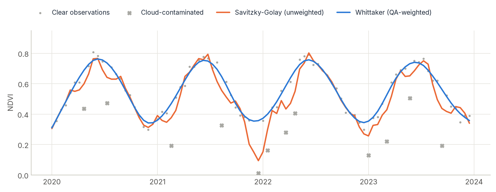

# STAC Data Cubes

<p class="lead">Build an analysis-ready data cube straight from a cloud catalog. You give an area, dates and bands, and get back a lazy xarray cube: nothing is downloaded until you compute, and then only the pixels you need are read.</p>

<div class="glance" markdown>
<div><span class="k">Does</span><span class="v">Search a STAC catalog, mask clouds, and stack the images into a cube</span></div>
<div><span class="k">Sources</span><span class="v">Earth Search (AWS), Planetary Computer, Brazil Data Cube, any STAC API</span></div>
<div><span class="k">Output</span><span class="v">A Dask-backed <code>xarray.DataArray</code> shaped <code>(time, band, y, x)</code></span></div>
<div><span class="k">Next</span><span class="v">Composite, smooth, and feed any algorithm</span></div>
</div>

[STAC](https://stacspec.org) (SpatioTemporal Asset Catalog) is the standard way cloud providers publish satellite imagery. Zeit searches a catalog, keeps the images that match your query, and assembles them with `stackstac` into one aligned cube.

## 1. Query a catalog

Select the area with a bounding box, a vector file (`vector_path`), or tile IDs: MGRS for Sentinel-2, WRS-2 path/row for Landsat.

```python
import zeit

# Option A: Bounding Box
cube = zeit.build_time_series(
    source="earth_search",
    collection="sentinel-2-l2a",
    bbox=[-48.5, -22.5, -48.0, -22.0],
    start_date="2022-01-01",
    end_date="2022-12-31",
    bands=["red", "green", "blue", "nir"]
)

# Option B: MGRS Tiles (Sentinel-2)
cube_tiles_s2 = zeit.build_time_series(
    source="earth_search",
    collection="sentinel-2-l2a",
    tiles=["22JFQ", "22JGQ"], # Fetch specific Sentinel-2 MGRS tiles
    start_date="2022-01-01",
    end_date="2022-12-31",
    bands=["red", "green", "blue", "nir"]
)

# Option C: WRS-2 Path/Row Tiles (Landsat)
cube_tiles_l8 = zeit.build_time_series(
    source="earth_search",
    collection="landsat-c2-l2",
    tiles=["215065"], # 6-digit Path/Row string (Path 215, Row 065)
    start_date="2022-01-01",
    end_date="2022-12-31",
    bands=["red", "green", "blue", "nir"]
)
```

## 2. Mask clouds

Zeit can automatically identify the satellite platform (Sentinel-2, Landsat) and apply semantic cloud masking natively before returning the cube. Just pass `apply_cloud_mask=True`. 
This will automatically download the respective Quality Assurance (QA) band (like `scl` for Sentinel) and mask out clouds, shadows, and cirrus.

```python
cube_clean = zeit.build_time_series(
    source="earth_search",
    collection="sentinel-2-l2a",
    tiles=["22JFQ"],
    start_date="2022-01-01",
    end_date="2022-12-31",
    bands=["red", "green", "blue", "nir"],
    apply_cloud_mask=True # Clouds are masked out!
)
```

## 3. Other sensors (MODIS and Sentinel-1)

`build_time_series` is not hardcoded to Sentinel-2/Landsat — it talks to any STAC API, so switching `source`/`collection`/`bands` is enough to pull other sensors from a catalog that hosts them. Microsoft Planetary Computer is the most complete public option for MODIS and Sentinel-1.

**Caveat:** `apply_cloud_mask=True` only knows how to decode Sentinel-2's `scl` and Landsat's `qa_pixel` bands (see `zeit/cube.py`). For MODIS and Sentinel-1, leave `apply_cloud_mask=False` and handle QA/no cloud-masking as shown below.

**MODIS (vegetation indices, 250m/16-day)**

```python
import zeit
from zeit.qc import qc_modis_summary

cube_modis = zeit.build_time_series(
    source="planetary_computer",
    collection="modis-13Q1-061",  # NDVI/EVI 250m, 16-day composites (modis-09A1-061 for 500m/8-day surface reflectance)
    bbox=[-52.10, -12.55, -51.95, -12.40],
    start_date="2010-01-01",
    end_date="2023-12-31",
    bands=["250m_16_days_NDVI", "250m_16_days_pixel_reliability"],
    apply_cloud_mask=False,  # not recognized for MODIS - masked manually below
)

ndvi = cube_modis.sel(band="250m_16_days_NDVI") * 0.0001  # apply the collection's scale factor
qa = cube_modis.sel(band="250m_16_days_pixel_reliability")

# 0=good, 1=marginal, 2=snow/ice, 3=cloudy -> [1.0, 0.5, 0.2, 0.2]
weights = qc_modis_summary(qa)
```

For 500m 8-day surface reflectance (`modis-09A1-061`), decode the `sur_refl_state_500m` QA band with `zeit.qc.qc_modis_state` instead.

**Sentinel-1 SAR (radar, no clouds)**

```python
cube_s1 = zeit.build_time_series(
    source="planetary_computer",
    collection="sentinel-1-rtc",  # radiometrically terrain-corrected, analysis-ready (prefer this over the raw "sentinel-1-grd" unless you plan to do RTC yourself)
    bbox=[-52.10, -12.55, -51.95, -12.40],
    start_date="2020-01-01",
    end_date="2023-12-31",
    bands=["vv", "vh"],
    resolution=10,
    apply_cloud_mask=False,  # SAR is unaffected by clouds - never pass apply_cloud_mask=True here
)
```

Radar backscatter is dense (Sentinel-1 revisits every 6-12 days regardless of cloud cover), which makes it a strong complement to optical CCDC/LandTrendr/Mann-Kendall runs in persistently cloudy regions. Check the actual pixel value range before feeding it downstream — RTC gamma-naught can come back as either dB or linear power depending on the processing pipeline, and that changes how you interpret slope/magnitude.

Neither `earth_search` nor `brazil_data_cube` currently expose MODIS or Sentinel-1 collections, so `planetary_computer` is the practical default for both. `source` also accepts any custom STAC API URL (e.g. a national or provider-specific SAR catalog) if you need one outside the three built-in aliases.

## 4. Composite to a regular time step

Raw STAC data usually comes in irregular time steps (e.g., passing every 5, 8, or 12 days). For advanced Machine Learning and TWDTW, you must regularize the cube to fixed temporal steps.

You can use `zeit.regularize_time_series` to composite these observations into regular windows (e.g., 16-day composites) using multi-dimensional `medoid` or `median` strategies. Because it uses `xarray`, this computation remains fully lazy!

```python
from zeit import regularize_time_series

# Create a 16-day Medoid composite
cube_16d = regularize_time_series(cube_clean, freq="16D", method="medoid")

# The output has regular 16-day steps on the 'time' dimension
print(cube_16d.time)
```

## 5. Compute spectral indices

If you wish to obtain only a specific spectral index like NDVI, there are two possible scenarios depending on the STAC catalog:

**1. The index is pre-calculated by the provider**
If the catalog (such as Brazil Data Cube) natively provides an `ndvi` asset, you can fetch it directly without downloading the raw optical bands:
```python
cube_ndvi = zeit.build_time_series(
    source="brazil_data_cube",
    collection="CBERS4A_WFI_L4_SR",
    tiles=["022024"],
    bands=["ndvi"] # Direct index download
)
```

**2. The index is NOT pre-calculated (e.g., Earth Search)**
Standard Level-2A collections typically do not store the index to save space. You must explicitly download the `red` and `nir` bands and calculate the index locally. Because Zeit is built on Dask, this mathematical operation is lazy and virtually memory-free until you save it or plot it.
```python
cube_raw = zeit.build_time_series(
    source="earth_search",
    collection="sentinel-2-l2a",
    tiles=["22JFQ"],
    bands=["red", "nir"]
)

# Compute NDVI lazily
cube_ndvi = (cube_raw.sel(band="nir") - cube_raw.sel(band="red")) / (cube_raw.sel(band="nir") + cube_raw.sel(band="red"))
```

## 6. Smooth noisy series

Even after masking and compositing, some cloud-affected values remain. Two smoothers work along the time axis of a `(time, rows, cols)` array:

<figure markdown>
  
  <figcaption>Savitzky-Golay follows the cloud drops because it treats every point equally. The Whittaker smoother, given weights of 0 for the cloudy observations, ignores them and recovers the seasonal curve.</figcaption>
</figure>

```python
from zeit.smooth import apply_savgol_filter, apply_whittaker_filter

smooth_sg = apply_savgol_filter(ndvi, window_length=7, polyorder=2)

weights = clear.astype(float)             # 1 = clear, 0 = cloudy, or QA weights from zeit.qc
smooth_wh = apply_whittaker_filter(ndvi, lmbd=10, weights=weights)
```

`lmbd` sets the smoothness of the Whittaker filter: larger values give a stiffer curve. For per-observation weights from a QA band, see `zeit.qc` (`qc_sentinel2_scl`, `qc_modis_summary`, `qc_modis_state`).

## Local GeoTIFFs instead of a catalog

Already have the files on disk? `build_local_cube` builds the same kind of lazy cube from a folder, parsing dates and bands from the file names.

```python
from zeit import build_local_cube

# Assume you have files like: "SENTINEL_20220101_B02.tif"
# The regex must capture (?P<date>...) and (?P<band>...)
cube_local = build_local_cube(
    data_dir="/path/to/my/tiffs",
    regex_pattern=r".*_(?P<date>\d{8})_(?P<band>B\d{2})\.tif",
    date_format="%Y%m%d"
)

# You get a full xarray DataArray ready for TWDTW, SOM, or CCDC!
```

## Next steps

The cube is ready for any analysis. Common next steps:

- one value per year for [LandTrendr](landtrendr.md) or [Mann-Kendall](mann_kendall.md): `cube.groupby("time.year").max()`;
- regular 16-day composites for [BFAST](bfast_monitor.md), [phenology](phenology.md) and [TWDTW](twdtw.md);
- every clear image, multi-band, for [CCDC](ccdc.md).
