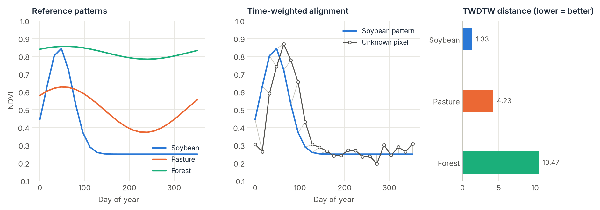

# Pattern Matching (TWDTW)

<p class="lead">Classify pixels by comparing their time series with a few reference patterns, one per class. Time-Weighted Dynamic Time Warping lets a pattern stretch and shift to match a pixel (a crop planted three weeks late is still that crop) while penalising shifts that would be implausible.</p>

<div class="glance" markdown>
<div><span class="k">Answers</span><span class="v">Which known temporal pattern does this pixel look like?</span></div>
<div><span class="k">Input</span><span class="v">Pixel series and one reference series per class, with day numbers</span></div>
<div><span class="k">Output</span><span class="v">A class map and a distance (match quality) map</span></div>
<div><span class="k">Reference</span><span class="v">Maus et al. (2016)</span></div>
</div>

<figure markdown>
  
  <figcaption><strong>What TWDTW does.</strong> Left: reference NDVI patterns for three classes. Middle: a soybean field planted about three weeks later than the reference; the grey lines show how TWDTW aligns each observation to the pattern despite the shift. Right: distances to each class. The pixel is correctly labelled soybean (lowest distance).</figcaption>
</figure>

## How it works

Plain distances compare observation 1 with observation 1, 2 with 2, and so on, so a small shift in timing looks like a big difference. **Dynamic Time Warping** finds the best alignment between two series instead, allowing one to be locally stretched or compressed. The **time-weighted** version (TWDTW) adds a cost that grows with the time gap $\Delta t$ (in days) between matched points, following a logistic curve:

$$
w(\Delta t) = \frac{\alpha}{1 + e^{-\beta\,(\Delta t - \gamma)}}
$$

Small seasonal shifts are cheap; implausible ones (matching a January peak to a July peak) are expensive.

The implementation is C++ with OpenMP across pixels, a two-row dynamic program that stays in the CPU cache, LB_Keogh lower bounds, and early abandoning of hopeless matches.

## Step by step

### 1. Define reference patterns

Each pattern is a pair `(values, days)`. Use the same day numbering for patterns and pixels, for example day of year. Patterns usually come from the average of a few labelled samples per class.

```python
import numpy as np
import cdts

days = np.arange(0, 365, 16)                     # a 16-day series over one year
t = days / 365

patterns = {
    "Soybean": (0.25 + 0.60 * np.exp(-0.5 * ((t - 0.12) / 0.08) ** 2), days),
    "Pasture": (0.50 + 0.08 * np.cos(2 * np.pi * t) + 0.10 * np.sin(2 * np.pi * t), days),
    "Forest":  (0.82 + 0.02 * np.cos(2 * np.pi * t) + 0.03 * np.sin(2 * np.pi * t), days),
}
```

### 2. Compare one pixel

```python
from cdts.twdtw import run_twdtw

pixel = ...   # 1-D array of NDVI values on `days`
for name, (values, pdays) in patterns.items():
    print(name, round(run_twdtw(pixel, days, values, pdays), 2))
# Soybean 1.33
# Pasture 4.23
# Forest 10.47
```

These are the distances in the figure above. Pass `return_path=True` to also get the alignment, a list of `(pixel_index, pattern_index)` pairs.

### 3. Classify a whole cube

`classify_twdtw` runs every pattern against every pixel in parallel and keeps the closest:

```python
from cdts.twdtw import classify_twdtw

# cube: (rows, cols, time) or (rows, cols, time, bands). Note: time comes after space here.
classes, distance, names = classify_twdtw(cube, days, patterns, n_jobs=-1)

print(names)                    # ['Soybean', 'Pasture', 'Forest']
label_map = np.array(names)[classes]
```

`distance` is the TWDTW distance to the winning class. High values mean no pattern fits well, which usually deserves a separate "unknown" label:

```python
classes = np.where(distance > np.percentile(distance, 95), -1, classes)
```

If your cube is `(time, rows, cols)`, move the time axis first: `np.moveaxis(stack, 0, -1)`.

### Several bands at once

Give pixels a trailing band axis, `(rows, cols, time, bands)`, and patterns shaped `(time, bands)`. The distance then uses all bands together (Euclidean across bands).

## Parameters

| Parameter | Default | Effect |
| :--- | :---: | :--- |
| `alpha` | `0.1` | Maximum time cost, reached for very large gaps. Higher values make timing matter more relative to the index values. |
| `beta` | `0.05` | Steepness of the logistic curve (per day). |
| `gamma` | `50.0` | Gap, in days, at which the time cost is half of `alpha`. Shifts much shorter than this are nearly free. |
| `max_time_warp` | `365` | Largest allowed shift, in days (a Sakoe-Chiba band). |
| `subsequence_matching` | `False` | Search for a short pattern anywhere inside a longer series. |

Tune `gamma` and `max_time_warp` (and `alpha` for how much timing matters) on a few labelled pixels before classifying a whole area.

## References

- Maus, V., Câmara, G., Cartaxo, R., Sanchez, A., Ramos, F. M., & de Queiroz, G. R. (2016). A time-weighted dynamic time warping method for land-use and land-cover mapping. *IEEE Journal of Selected Topics in Applied Earth Observations and Remote Sensing*, 9(8), 3729–3739. [doi:10.1109/JSTARS.2016.2517118](https://doi.org/10.1109/JSTARS.2016.2517118)
- Keogh, E., & Ratanamahatana, C. A. (2005). Exact indexing of dynamic time warping. *Knowledge and Information Systems*, 7(3), 358–386. [doi:10.1007/s10115-004-0154-9](https://doi.org/10.1007/s10115-004-0154-9)
